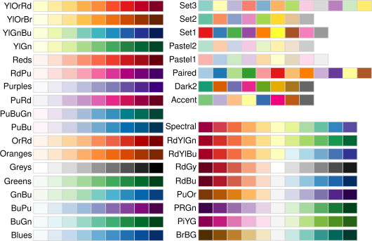

```{r setup, echo=FALSE, warning=FALSE}
library(whoppeR)
library(pander)
library(ggplot2)

knitr::opts_chunk$set("warning"=FALSE, "message"=FALSE, "fig.align" = 'center', "cache"=TRUE, dev='svg')

theme_set(theme_grey(24) +
            theme(plot.margin = margin(12,1,1,1),
                  legend.box.margin = margin(0,0,0,-20),
                  plot.title = element_text(size=16, margin = margin(-10)),
                  plot.subtitle = element_blank()
                  )
          )
```

## The Grammar of Graphics
The `ggplot2` package provides a library of plotting and graphics tools that implements the ["Grammar of Graphics"](http://www.springer.com/us/book/9780387245447) (Wilkinson, 2005; Wilkinson, Anand, & Grossman, 2005).

Wilkinson's "Grammar of Graphics" is both a technical description of the structures used to produce quantitative visualizations, as well as a new language to describe the visual features of quantitative visualizations.

In many ways, it formalizes what you know about plots and graphs intuitively, but probably didn't have specific words for.


???

Hello Statisticians! In today's video, I'm going to be introducing you to the ggplot2 R package, which we'll be using throughout the class to create visualizations of our data. ggplot2 is certainly an odd name for an R package, but those those two G's have some important significance.

The `ggplot2` package provides a library of plotting and graphics tools that implements the the data visualization theory known as the grammar of graphics "Grammar of Graphics" developed by Leland Wilkinson. 

Wilkinson's "Grammar of Graphics" is both a technical description of the structures used to produce quantitative visualizations, as well as a new language to describe the visual features of quantitative visualizations. In many ways, it formalizes what you know about plots and graphs intuitively, but probably didn't have specific words for.

Since the ggplot2 package is specifically organized around this theory, we're going to first spend some time explaining the key elements in this theory, since all of these elements will show up in the R code we write to produce a plot. So, bear with me while we dive into the big ideas underpinning the ggplot2 graphics. I hope by the end of this class, you'll appreciate the value of having a visualization tool that is rooted in the best way to describe any visualization, instead of a visualization tool that tries to create plots with the shortest code possible.

--

Before going any further, let's make sure the `ggplot2` package is installed and loaded in R

```{r fakeinstall, eval=FALSE}
install.packages("ggplot2") # only need to do this once
library(ggplot) # need to do this every time you open RStudio
```

???

Before going any further, let's make sure the `ggplot2` package is installed and loaded in R by using the install.packages and library functions. 


**Go to R**

Don't forget the 2 at the end of the package name each time!

---

## The Grammar of Graphics
The `ggplot` system of plotting distinguishes between four main sets of features that all visualizations posses.

- Data
    - The observations that the plot is dedicated to displaying
- Geoms
    - The geometric objects used to instantiate the data visually
- Aesthetics
    - The perceptual features of the data displayed in a plot
- Scales
    - The aspects of a plot that allow you to measure the aesthetics

???

OK, now that we've got the ggplot2 package set up, let's start digging into the grammar of graphics theory, and work our way towards writing some code to make plots.

...

I'll explain and give examples of each component, starting with the data component.

---

## Data

- The source of the observations in a ggplot is always a `data.frame` object in R

- A `data.frame` is like a table of data arranged in "tidy" form
    - Rows are all observations from one unit
    - Columns are all measurements of one variable

???

If we don't have a data frame, we can't make a plot using ggplot

---

## Aesthetics

Aesthetics are the "simple" features possessed by data when they are displayed visually

- The color of a datum is one of its aesthetics
- The x position of a datum is one of its aesthetics
- The y position of a datum is one of its aesthetics
- The size of a datum is one of its aesthetics
- The shape of a datum is one of its aesthetics

--

In any visualization, aesthetics may or may not be used to carry information about the data set

  - E.g., the color of each datum may be the same, or colors may differ in order to convey that there are different groups of data.

---

## Geoms

Geoms are the geometric objects chosen to instantiate the data visually. Example of geoms are points, lines, bars, or text.

Choosing the right geom can bring clarity to your visualization

  - The same observations could be visualized with circles, or lines, or rectangular bars, or with all 3!

--

Different geoms have different aesthetics
  
  - A bar can't have a shape aesthetic (it's already a rectangle), but it can take on different border colors, different fill colors, and different positions
  - A line can't have a shape aesthetic (it's a line) or a fill aesthetic (it's 1D, you can't fill it), but it can have different types (dotted, dashed, etc) and line colors.

---

## Scales
Scales are the features of a plot that allow you to measure the aesthetics (i.e., map them back from colors and shapes to the variable and values of the dataset)

  - The ticks and labels on the x axis might allow you to match axis position with a specific date
  - The colors and labels in a legend allow you to match colors to a specific group

--

The general term "scales" is chosen over the more common term "legend" because it includes features of the plot that are used for measuring aesthetics, but are not part of a separate legend (e.g., the ticks marks along the x axis)

???

A synonym for scales might be "legends", but in ggplot, the more general term "scales" is chosen over the more common term "legend" because it allows you to talk about features of the plot that are used for measuring aesthetics the same way a legend does, but are not actually part of a distinct, separate legend, such as the ticks marks along the x axis.
---

### The Big 3: Data, Aesthetics, and Geoms

Every time you create a new ggplot, you **must** supply the data, you **must** specify the aesthetics to use, and you **must** specify the geometric objects to draw.

Scales come for free (but you can still customize the defaults)

???

In terms of constructing a plot, three of these components must be supplied by the person constructing them, and the fourth one is usually created automatically. Every time you create a new ggplot, you **must** supply the data, you **must** specify the aesthetics to use, and you **must** specify the geometric objects to draw.

If you do all of this correctly, the scales of the plot come free, which is a way of saying that they are added automatically. Even still, you are able to customize the scale to your liking.

---

## Aesthetics Mappings Rule Everything Around Me
The main aim of the `ggplot` tool set is to take the relational structure  you've already defined in your data frame (each row = 1 observation; each column = one measured variable) and translate it into a visualization via *aesthetic mappings*.

When you specify an aesthetic mapping, you are telling ggplot "this variable in my data set should control this aspect of my plot"
  - e.g., "Variable A should determine where the data falls along the x axis"

???

The most important piece of the grammar of graphics theory is the idea of an aesthetic mapping. Every time you create a ggplot, you explicitly specify the aesthetic mapping that you want to use. This mapping will allow you to translate the relational structure you've already defined in your data frame (where each row = 1 observation and each column = one variable) into a visualization by connecting a column of your data frame to an aesthetic in your plot.

Basically, when you specify an aesthetic mapping, you are telling ggplot "this variable in my data set should control this aspect of my plot". For example, your aesthetic mapping might say something like "Variable A should determine where the data falls along the x axis"

--

ggplot2 can be difficult to use if you fight against this principle instead of leaning into it

This means that sometimes, the best way accomplish a task in ggplot means organizing your data in such a way that aesthetic mappings naturally create the plot you want.

---

## A First Example
Let's practice using all these ideas with a data set from a fictional experiment on time perception. 

.pull-left[
- `subject` = participant ID number
- `trial` = trial ID number
- `instructed` = how many second the participant was told to wait
- `actual` = how long the participant actually waited
- `group` = what group the participant was in (long wait in the lobby, or short wait)
]

.pull-right[
```{r, echo=-1}
Time <- data.frame(subject = c(1,1,1,2,2,2),
                   trial = c(1,2,3,1,2,3),
                   instructed = c(5, 2, 1, 2, 5, 3),
                   actual = c(4.75, 2.11, .94, 1.5, 5.63, 3.31),
                   group = c("long", "long", "long", "short", "short", "short"))
Time
```
]

???

Imagine an experiment where human participants have to press a button when they see a cross appear in the center of a computer monitor. But, they are instructed to wait a certain amount of time before pressing the button. For example, sometimes they would be told to wait 3 seconds before pressing the button, or 2 seconds, or 5 seconds. Before the experiment starts though, the participants have to wait in a lobby, and unbeknownst to the participants, the experimenters purposefully left some participants waiting in the lobby longer than others. The goal of the experiment was to see if having a long wait to start the experiment would affect how long people waited to press the button.

The data from two participants is shown in the `Time` data frame. The each column in the data frame reflects information measured on each trial, and each row reflects an individual trial.


---

## Creating a plot
Making a plot with `ggplot2` always begins with a call to the `ggplot` function, which takes 2 arguments:

  - `data`: The name of the data frame which holds the information you'd like to plot
  - `mapping:` A list of pairs that connects variables in your data frame to the aesthetics of the plot
    - The list of mapping pairs is created with the special function `aes`

???

Let's use ggplot to make a scatter plot, which shows the relationship between two numeric variables by displaying each observation as a single point on the plot, with the x axis position determined by the value of one of the variables, and the y axis position determined by the value of the other variable. In this experiment, one thing we're interested in the difference between how long participant were told to wait, and how long they actually waited. If participants were perfect, and able to wait the exact amount of time they were told on each trial, all the points in the scatter plot should fall on a straight line, because the actual wait time and the instructed wait time would be equal, meaning the x and y positions for each point would be identical.

No matter what kind of plot we're going to make, we always begin the code for making our plot by using the ggplot2 function, and providing two arguments.  The first one is the data argument, where we tell ggplot the name of the data frame where it can find all of the observations we want to plot. 

The second argument is list of aesthetic mapping pairs that connects variables in your data frame to the aesthetics of the plot. This list is created using a second function, the `aes` function. Let's write out the code we would use to start making a scatterplot of the instructed wait times and the actual wait times.

--

So to start off a scatterplot of instructed wait time vs. actual wait times, we would write:
```{r eval=FALSE}
ggplot(data = Time, mapping = aes(x=instructed, y=actual))
```


???

So to start off a scatterplot of instructed wait time vs. actual wait times, we would write...

Let's go to R and actually do this. **GO TO R, START R MARKDOWN**

Inside the parenthesis of the ggplot plot function I told it the data to use for plotting by writing data = Time, and I told it the aesthetic mappings to use by writing mapping = aes(x=instructed, y=actual).

**RUN THE CODE, WHICH WILL MAKE A BLANK PLOT**

OK, something happened, but, it's not quite a scatter plot. It looks like we have the outline of a plot, but no data is shown in it. What's the deal?
---

## We need a geom!

.pull-left[
Uh, oh, our plot is blank because we didn't add any geometric objects to represent the data!

In ggplot, we add a geom objects to represent the data by adding a new "layer" containing those geom objects onto the plot.
]

.pull-right[
```{r echo=FALSE}
ggplot(data = Time, mapping = aes(x=instructed, y=actual))
```
]

???

Well, a few slides back, I mentioned that there were three things we always needed to supply when making a plot. We need to specify the data, aesthetic mapping, and the geometric objects to draw the data with. Well, I bet you can see which one we forgot - the geometric objects?

So, why did I purposely leave off this necessary component? Because the geoms are added to a plot in a different way than how we specified the data and aesthetic mappings. In ggplot2, geometric objects are drawn by adding a second layer to the "base" layer which we've drawn.

---

## We need a geom!
To add this new layer, we need two things: a function to create the geometric object layer, and function to add it to the plot.

--

As mentioned earlier, ggplot supports many different geometric objects, and there is a different function to create the layer for each one. 

The names of the these functions follow a common pattern: `geom_`, followed by the name of the geometric object.

  - `geom_point`, `geom_line`, `geom_bar`, `geom_boxplot`, etc.

Since we want to make a scatterplot, and a scatterplot displays each individual observation as a separate point, then we need to use the `geom_point()` function.

--

And, to add this geom to the plot, we literally add it - using the `+` symbol!

---

## Completing our scatterplot

.pull-left[

Let's add the points to our scatterplot now, with the following code:

<pre><code class="r hljs remark-code"><div class="remark-code-line">ggplot(data = Time,</div>
<div class="remark-code-line">       mapping = aes(x=instructed,</div>
<div class="remark-code-line">                     y=actual)</div>
<div class="remark-code-line">       )<span class="remark-code-line-highlighted"> +</span></div>
<div class="remark-code-line"><span class="remark-code-line-highlighted">  geom_point()</span></div>
</code>
</pre>

]

???

You don't need to break everything onto it's own line for this code to work, I'm just doing that to make everything fit nicely on the slide. But, you also don't want to have lines of code that are super super long, as they can be very hard to read. As with most things, balance is best.

--

.pull-right[
```{r scatter, echo=FALSE}
ggplot(data = Time,
       mapping = aes(x=instructed,
                     y=actual)
       ) +
  geom_point()
```
]

---

## Connecting code to plot via data

.pull-left[

```{r eval=FALSE}
ggplot(data = Time,
       mapping = aes(x=instructed,
                     y=actual)
       ) +
  geom_point()
```

```{r}
Time
```

]

.pull-right[
```{r ref.label="scatter", echo=FALSE}
```
]

---
## More Aesthetic Mappings: Color

Our scatterplot *does* show the relationship between actual and instructed time, but right now, there's no way to tell which condition the subject was in when the responded.

But we can easily fix that by adding a third aesthetic mapping

We can color each point according to the condition it came from by setting `color = group` inside the `aes` function

---

## Adding color
.pull-left[
<pre><code class="r hljs remark-code"><div class="remark-code-line">ggplot(data = Time,</div>
<div class="remark-code-line">       mapping = aes(x=instructed,</div>
<div class="remark-code-line">                     y=actual,</div>
<div class="remark-code-line">                     <span class="remark-code-line-highlighted">color=group</span>)</div>
<div class="remark-code-line">       ) +</div>
<div class="remark-code-line">  geom_point()</div>
</code></pre>

Note that we got a legend describing each color automatically!
]

.pull-right[
```{r color, echo=FALSE}
ggplot(data = Time,
       mapping = aes(x=instructed,
                     y=actual,
                     color=group)
       ) +
  geom_point()
```
]

---

## Connecting code to plot via data

.pull-left[

```{r ref.label="color", eval=FALSE}
```

```{r, echo=FALSE}
Time
```

]

.pull-right[
```{r ref.label="color", echo=FALSE}
```
]

---

## Adjusting the point size

.pull-left[
We can increase (or decrease) the size of the points by specifying a `size` value in the `geom_points` function.

<pre><code class="r hljs remark-code"><div class="remark-code-line">ggplot(data = Time,</div>
<div class="remark-code-line">       mapping = aes(x=instructed,</div>
<div class="remark-code-line">                     y=actual,</div>
<div class="remark-code-line">                     color=group)</div>
<div class="remark-code-line">       ) +</div>
<div class="remark-code-line">  geom_point(<span class="remark-code-line-highlighted">size=4</span>) <span class="hljs-comment"># 4x bigger</span></div>
</code></pre>

We **could** map the size aesthetic to a variable (e.g., have each point be a different size depending on the trial number). Setting the size outside the `aes` function just changes the size for **all** points.

]

.pull-right[
```{r size, echo=FALSE}
ggplot(data = Time,
       mapping = aes(x=instructed,
                     y=actual,
                     color=group)
       ) +
  geom_point(size=4)
```
]

---

## Adjusting the color scale
But, we may not like the colors R and ggplot2 pick for us. I'm going to show you two options for customizing the colors in your plots

1. Manually specifying each color
2. Using a specialized color "palette" that has been already built.

---

## Manual colors
ggplot includes a function called `scale_color_manual` for overriding the default colors with ones of your choosing.

You can use hexadecimal RGB color codes, or pick from one of R's 657 built-in color names!

```{r colors, R.options=list(width=85)}
colors() # prints the whole list of names!
```

---

## Manual Colors
.pull-left[

Let's try "wheat4" and "cadetblue2".

```{r eval=FALSE}
ggplot(data = Time,
       mapping = aes(x=instructed,
                     y=actual,
                     color=group)
       ) +
  geom_point(size=4) +
  scale_color_manual(c("wheat4", #<<
                       "cadetblue2")  #<<
                     ) #<<
```

Yikes!
]

.pull-right[
```{r wheat, echo=FALSE}
ggplot(data = Time,
       mapping = aes(x=instructed, y=actual, color=group)) +
  geom_point(size=4) +
  scale_color_manual(values=c("wheat4", "cadetblue2"))
```
]
---

## Pre-built Palettes

A pre-built color palette is perhaps a safer and easier choice. The `RColorBrewer` package comes with several pre-built palettes, which we can see by loading the package and using `display.brewer.all()`

```{r brewer, eval=FALSE}
library(RColorBrewer)
display.brewer.all() # it is a huge plot!
```



---

## Pre-built Palettes

.pull-left[
I'm a big fan of the "Set1" palette, and we can use it in our plot with the `scale_color_brewer` function:

```{r eval=FALSE}
ggplot(data = Time,
       mapping = aes(x=instructed,
                     y=actual,
                     color=group)
       ) +
  geom_point(size=4) +
  scale_color_brewer(palette="Set1")
```
]

.pull-right[
```{r echo=FALSE}
ggplot(data = Time,
       mapping = aes(x=instructed,
                     y=actual,
                     color=group)
       ) +
  geom_point(size=4) +
  scale_color_brewer(palette="Set1")
```
]
