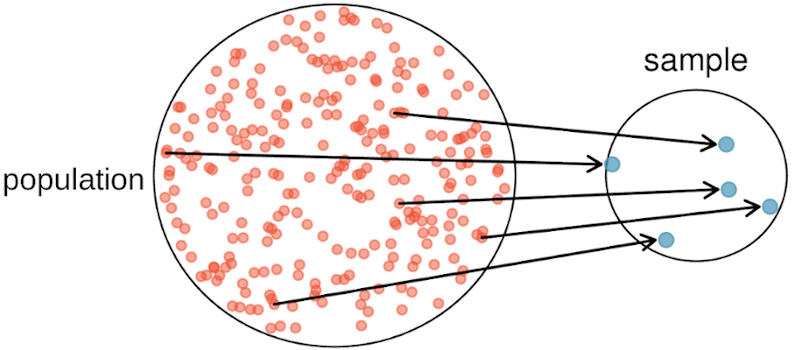
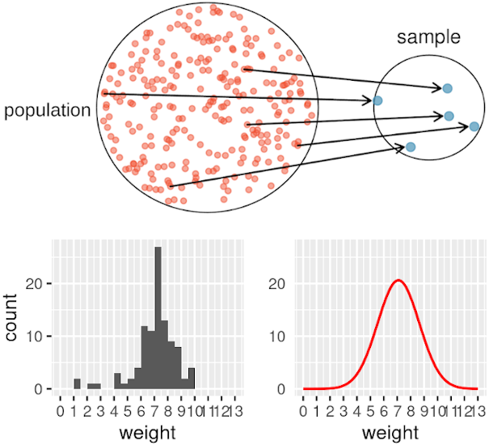

---
title: "Learning from Distributions"
author: "Will Hopper"
header-includes:
   - \usepackage{bbm}
output:
  xaringan::moon_reader:
    lib_dir: libs
    nature:
      highlightStyle: github
      highlightLines: true
      countIncrementalSlides: false
      ratio: '16:9'
    css: ["default", "default-fonts", "../../assets/css/sds.css"]
editor_options: 
  chunk_output_type: console
---

```{r include=FALSE}
knitr::opts_chunk$set(warning=FALSE, message=FALSE, fig.align='center', cache=TRUE, dev='svg', prompt=FALSE)

library(ggplot2)

theme_set(theme_grey(24) +
            theme(plot.margin = margin(12,1,1,1),
                  legend.box.margin = margin(0,0,0,-20),
                  plot.title = element_text(size=16, margin = margin(-10)),
                  plot.subtitle = element_blank()
                  )
          )
```


### Why care about distributions?

We often collect data to answer a targeted research question

  - e.g., Survey people to find out how wages have changed over time for different occupations and different races?

???

Hello statisticians! In this video, I'm going to take you on a deep dive into what we can learn from the distribution of a variable. The idea of a distribution is central to performing any kind of statistical inference procedure, from the simplest to the most intricate and advanced ones. In fact, one reason that we have so many different statistical procedures is that there are so many different distributions. It's not always obvious, but the computations we perform as part of statistical inference procedures are a direct consequent of what we know, or what we assume, about a variable's distribution.

However, distributions of data are often overlooked by practitioners of statistics, in part because they are focused on the answer to a specific research question. For example, we might perform an annual survey collecting information about people's occupation, wages, and race to examine how wages have changed over time for different occupations and different races.

In answering this question, a researcher might compress their raw survey responses into some summary statistics, like the average, so that they have one number for each occupation or racial group, and can answer their questions by comparing these values.

--

The reliability of our answers to these questions rests on what we know about the **distributions** of the variables we measure.

The computations we perform as part of statistical inference procedures are a direct consequent of what we know (or assume) about a variable's distribution.

???

However, the summary statistics alone cannot support reliable conclusions; we must taken into account what we know about the distribution of the variable we measure in order to make general conclusions.

So in this video, I'm going to introduce you to concept of a distribution, methods we use to construct them, and what we can learn by examining them.

---

### The `ncbirths` data set

The `ncbirths` data set has observations of the following variables:

- **fage**: Father's age in years. 
- **mage**: Mother's age in years. 
- **mature**: Maturity status of mother. 
- **weeks**: Length of pregnancy in weeks. 
- **premie**: Whether the birth was classified as premature or full-term. 
- **visits**: Number of hospital visits during pregnancy. 
- **gained**: Weight gained by mother during pregnancy in pounds. 
- **weight**: Weight of the baby at birth in pounds.  
- **sex**: Sex of the baby, female or male. 
- **smoker**: Status of the mother as a nonsmoker or a smoker

???

For all the examples, I'll be using observations from the `ncbirths` data set. This data set has a random sample of 1,000 births in the state of north Carolina occurring in 2004. For each birth, the following 10 variables were measured.

---

### The `ncbirths` data set in R

```{r eval=FALSE}
ncbirths <- read.csv("https://wjhopper.github.io/SSW-858/data/ncbirths.csv")
ncbirths
```

```{r echo=FALSE}
ncbirths <- read.csv("../../data/ncbirths.csv")
ncbirths
```

???

Here's what we would see after importing the data into R using the read.csv function, which downloads the data set from that URL and bring it into R as a data frame object. 

To simplify things a little bit, just for the purposes of demonstration, I'm going to work with just the 100 observations, and we're going to focus in on the weight variable

---

### 100 Birth Weights

```{r echo=FALSE}
ncbirths <- ncbirths[1:100,]

x <- ggplot(ncbirths, aes(x=weight)) +
  geom_histogram(binwidth = 1, boundary=0) +
  scale_x_continuous(breaks = seq(0,13,1), limits=c(0,13)) +
  theme(panel.grid.minor.x = element_blank())

d <-ggplot2::ggplot_build(x)$data[[1]][c("xmin","xmax","count","density")]

```

.talllines[
```{r}
ncbirths$weight
```
]

???

Here are the 100 observed birth weights. But despite having the data in hand, I wouldn't say we've learned anything yet, it's hard to make heads or tails of this wall of numbers. As I've alluded to, one of the most useful things we can do is examine the distribution of these values.

But, how do we go about doing that? Here', it's helpful to start by defining exactly what a distribution is

---

### What is a distribution?

A **distribution** is a function that describes the likelihood of observing a particular value when measuring a variable.

???

A **distribution** is a function that describes the likelihood of observing a particular value when measuring a variable. No more, no less. Now, sometimes the distribution function can be complex, and some of the things we do with this distribution function be complex, but at its core, a distribution is simply a function that says which outcomes are relatively likely, and which outcomes are relatively unlikely.

Just based on this, I hope you can begin appreciate how useful the distribution function can be - knowing which outcomes are likely and unlikely is almost like being able to predict the future! 

But, we don't have our amazing distribution function yet, we still just have a bunch of numbers. 

--

Our birth weight distribution should tell us which birth weights are likely to be observed and which are unlikely to be observed.

???

However, we do know what our distribution function should tell us in the end - it should tell us which birth weights are likely to be observed and which are unlikely to be observed.

---

### Constructing a sample distribution

???

One simple and effective approach to constructing this information is divide the data into discrete ranges, called bins, and simply count the number of 
birth weights that fall into each of these bins. So, let's do that our selves

First, let's define our bins, starting with the lowest birth weight ranges, and let's use a bin width of 1 pound. Our first bin will start at the lowest possible value on the weight scale, 0 and go up to 1 pound. The next bin will go from 1 pound to 2 pounds. If one of our birth weights falls exactly on the boundary, such as a birth weight of exactly 1 pound, we have to come up with a rule for deciding which bin to put the observation in. The choice is more or less arbitrary, so let's just decide that it falls into the left bin, so a birth weight of 1 will go into the 0-1 bin.

So with that decided, let's just go ahead and finish making our bins....

We'll go all the way up to 13, if a baby is heavier than 13 pounds I'll be very surprised.

--
.talllines[
```{r}
sort(ncbirths$weight)
```
]

???

Next, let's sort our 100 birth weights into ascending order, so it's easy to see how many fall into each bin.

Allright, we're ready to construct our distribution

```{r echo=FALSE}
knitr::kable(d[1:10,], format="html")
```

---

### Our sample distribution function

A piece-wise "step" function

$$\displaystyle f(x) = \begin{cases}
0 & \text{if } 0 < x \leq 1 \\ 
2 & \text{if } 1 < x \leq 2 \\ 
2 & \text{if } 2 < x \leq 3 \\
0 & \text{if } 3 < x \leq 4 \\ 
4 & \text{if } 4 < x \leq 5 \\ 
6 & \text{if } 5 < x \leq 6 \\
23 & \text{if } 6 < x \leq 7 \\ 
40 & \text{if } 7 < x \leq 8 \\ 
17 & \text{if } 8 < x \leq 9 \\
6 & \text{if }  9 < x \leq 10 \\
\end{cases}$$

---

### A Histogram is a distribution function

.pull-left[
```{r hist, eval=FALSE}
ggplot(ncbirths, aes(x=weight)) +
  geom_histogram(binwidth = 1,
                 boundary = 0) +
  scale_x_continuous(breaks = 0:13,
                     limits=c(0,13)
                     )
```
]

.pull-right[
```{r ref.label="hist", echo=FALSE}
```
]

---

### What does this mean?
.pull-left[
Birth weights between 7 and 8 pounds were the most frequent
  - Most frequent = most likely

Birth weights between 7 and 8 pounds were 1.73 more likely than birth weights between 6 and 7 pounds
  - 40/23 = 1.739
  
Birth weights between 7 and 8 pounds were 2.35 more likely than birth weights between 8 and 9 pounds
  - 40/17 = 2.352
]

.pull-right[
```{r ref.label="hist", echo=FALSE}
```
]

???

So, we've done a lot of a busy work to get to this point - what was it all for? Well, we're actually one step away from learning some really useful information.

We can easily see that birth weights between 7 and 8 pounds were the most frequent, with 40 births falling into this bin Here, another word we can use for most frequent is most likely. 

And we can compare the frequencies in each bin to find the relative likelihoods. Birth weights between 7 and 8 pounds were 1.73 more likely than birth weights between 6 and 7 pounds, because 40 is 1.73 times greater than 23.
  
And, birth weights between 7 and 8 pounds were 2.35 more likely than birth weights between 8 and 9 pounds, because 40 is 2.35 times greater than 17.

So, not only is a birth weights between 7 and 8 pounds the most likely outcome according to our sample, it's around twice as likely than another other range of birth weights, which is quite a large difference.

---

### A more fine grained distribution


???

This is great. There's just one thing bugging me - we don't know anything about what's going on **inside** the bins. We know birth weights between 7 and 8 pounds the most likely, but what about babies that are 7.25 pounds or 7.92 pounds? We don't know anything about them, they all get lumped together in the 7-8 pounds bin.

--

.pull-left.smaller-math[
$$\displaystyle f(x) = \begin{cases}
0 & \text{if } 0 < x \leq .5 \\ 
0 & \text{if } .5 < x \leq 1 \\ 
2 & \text{if } 1 < x \leq 1.5 \\
0 & \text{if } 1.5 < x \leq 2 \\ 
1 & \text{if } 2 < x \leq 2.5 \\ 
1 & \text{if } 2.5 < x \leq 3 \\
0 & \text{if } 3 < x \leq 3.5 \\ 
0 & \text{if } 3.5 < x \leq 4 \\ 
3 & \text{if } 4 < x \leq 4.5 \\
1 & \text{if }  4.5 < x \leq 5 \\
2 & \text{if } 5 < x \leq 5.5 \\ 
4 & \text{if } 5.5 < x \leq 6 \\ 
12 & \text{if } 6 < x \leq 6.5 \\
11 & \text{if } 6.5 < x \leq 7 \\ 
27 & \text{if } 7 < x \leq 7.5 \\ 
13 & \text{if } 7.5 < x \leq 8 \\
9 & \text{if } 8 < x \leq 8.5 \\ 
8 & \text{if } 8.5 < x \leq 9 \\ 
2 & \text{if } 9 < x \leq 9.5 \\
4 & \text{if }  9.5 < x \leq 10 \\
\end{cases}$$
]
.pull-right[
```{r hist_half_pound, echo=FALSE}
ggplot(ncbirths, aes(x=weight)) +
  geom_histogram(binwidth = .5,
                 boundary = 0) +
  scale_x_continuous(breaks = 0:13,
                     limits=c(0,13)
                     )
```
]

???

Let's break the data down in a more fine-grained fashion to see if we can learn something about the likelihoods of outcomes within each bin. So, instead of bin widths of 1 pound, let's try a half pound

---

### A more fine grained distribution

7-7.5 was twice as frequent as 7.5-8! Can we go further? How about bins of $\frac{1}{10}$ pound?

--

.pull-left[
```{r echo=FALSE}
ggplot(ncbirths, aes(x=weight)) +
  geom_histogram(binwidth = .5,
                 boundary = 0) +
  scale_x_continuous(breaks = 0:13,
                     limits=c(0,13)
                     ) +
  ggtitle("Binwidth = .5")
```
]

.pull-right[
```{r echo=FALSE}
ggplot(ncbirths, aes(x=weight)) +
  geom_histogram(binwidth = .1,
                 boundary = 0) +
  scale_x_continuous(breaks = 0:13,
                     limits=c(0,13)
                     ) +
  ggtitle("Binwidth = .1")
```
]

???

OK, on the left we have our trusty sample distribution made using bins that are a half-pound wide, and on the right, we have our new distribution, make using bins that are a tenth of a pound wide.

This one looks quite a bit different - the distribution has become jagged, kind of sawtooth like. If given a choice between these two distributions, most people will say that the distribution on the left is the "right" one, and the distribution on the right is the "wrong" one.

But it's not as simple as "right" and "wrong". Both of these are distributions of our sample, and they're both perfectly accurate. We did indeed observe 2 births with a birth weight between 9.5 and 9.6 pounds, and we did indeed observe 10 births between 7.4 and 7.5 pounds. Both of those statements are exactly as accurate as saying we observed 27 births between 7 and 7.5 pounds. 

---

### Too fine?

.pull-left[
Implies very similar weights have very different likelihoods
  - 7.4-7.5 is 3.33 times as likely as 7.3-7.4?

Implies some values are impossible
  - 8 has a likelihood of 0, despite observing values of 7.9 and 8.1 in the same sample?
  
This seems wrong and misleading, but why?

]

.pull-right[
```{r echo=FALSE}
ggplot(ncbirths, aes(x=weight)) +
  geom_histogram(binwidth = .1,
                 boundary = 0) +
  scale_x_continuous(breaks = 0:13,
                     limits=c(0,13)
                     ) +
  ggtitle("Binwidth = .1")
```
]

???

So, we do we feel like one is wrong and the other is right? I would argue it's because deep down, we know that there shouldn't be a big difference in likelihood between really similar values.

For example, this distribution implies 7.4-7.5 is 3.33 times as likely as 7.3-7.4? It also implies that some values are impossible, showing that 8 pounds has a likelihood of 0, despite observing values of 7.9 and 8.1 in the same sample? That doesn't seem right.

So, how do we reconcile our intuition that similar values should have similar likelihoods in a distribution, meaning this distribution isn't accurate, with the fact that this distribution is a perfectly accurate description of our sampled data?

The discrepancy all comes down to what observations we're talking about when we use the word "likely". Whenever we've used the word "likely", we've been implicitly talking about the future - not thinking about what kinds of birth weights we already saw, but what kind of birth weight might we see for the next child born, and the next child born, and the next child after that.

In other words, when we've been talking about what values are likely, and how much more likely one weight is than another weight, we've been thinking about what values are likely for **all possible** values that could be observed.

---

### The Population

Population: all possible observations (e.g., all possible births)

.center[

]

--

We use our sample distribution (i.e., our histogram) to estimate the **population distribution**: The function that describes how likely any particular value is to be observed *in the population*.

???

Statisticians have a specific word for the set of all possible observations **the population**, and that's really the distribution we've been thinking about this entire time.

We've constructed a distribution that describes our sample, but we think about it as describing the population, the collection of all possible births and birth weights that might occur: all the births that have happened, and haven't been measured, and all the births that haven't been measured because they haven't even happened yet!! So, the population distribution distribution has to describe the likelihoods of all the events out of a potentially infinite set of events.

---

### The population distribution

.pull-left[
Population distributions are usually represented using smooth curves (for numeric variables, at least)

The red curve is a **normal distribution**: a symmetric, unimodal distribution which describes the likelihoods of many variables
  - Symmetric = both sides have same shape
  - Unimodal = single peak
  
Assumption of "normality" underpins many statistical methods we will use.
]

.pull-right[
```{r echo=FALSE}
ggplot(ncbirths, aes(x=weight)) +
  geom_histogram(binwidth = .1, boundary = 0) +
  stat_function(fun = function(x,y,z) {dnorm(x,y,z)*20},
                args=list(mean(ncbirths$weight),
                          sd(ncbirths$weight)),
                color="red", size=1.5
                ) +
  scale_x_continuous(breaks = 0:13, limits=c(0,13)) +
  ggtitle("Binwidth = .1")
```
]

???

Since they have to represent the likelihood of **EVERY** possible value, down to the 100th decimal place, population distributions are usually represented using smooth curves. That way, no event is left out at all.

The red curve is a **normal distribution**: a symmetric, unimodal distribution which describes the likelihoods of many variables. By symmetric, I mean the both the left and the right half of the distribution have exactly the same shape. By unimodal, I mean that the distribution has a single peak, meaning that there is one single value that holds the title of "most likely".

Many of the procedures we use in this class will make an assumption "under the hood" that the variables we observe have a normal distribution for their population distribution.

---

### The Normal distribution

$$f(x) = \frac{1}{{\sigma \sqrt {2\pi } }}e^{\frac{ \left( {x - \mu } \right)^2 }{\sigma ^2 }}$$

.center[

]

???

Just like our sample distribution had a mathematical form as well as visual form, so does the normal distribution.

The details of this equation are not particularly important, but the reason I even bring it up is to point out two important symbols in this equations. We see two Greek letters in this equation, mu and sigma.

These two symbols control the center and width of the normal distribution. As we can see in the figure, if we decrease the value of mu, from 0 to -2, the center of the distribution shifts to the left, and the most likely value is -2. 

If we change the value of sigma, we change the width of the distribution. Using smaller values of sigma create narrower distributions. As we can see in the figure, a sigma squared value of .2 produces a much narrow distribution than a sigma squared value of 1, which in turn produces a much narrow distribution than a sigma squared value of 5.

Since they control the appearance of this distribution, we refer to mu and sigma as parameters. So, if we want to change the range of events that is considered "most likely", we would change the mu parameter. If we wanted to include a wider range of events in the set of possible outcomes, we would change the mu parameter. Later on in the course, we'll connect the mu and sigma symbols to population level statistics like the mean and standard deviation.

---

### The population is an idea

How do we know the correct population distribution, or the correct values of $\mu$ and $\sigma$?

???

A natural question to have upon hearing about the population distribution is, well, how do we know what it is? How do we know it's a normal distribution? How do we know what values mu and sigma should be to accurately describe the population?

--

99.9% of the time, we don't and we never will.

???

The fact of the matter is, we don't, and probably never will. Now, sometimes in class, we'll have a contrived example where we **ASSUME** we know what the population distribution is. But, this is usually just an assumption for the sake of demonstration, just for the sake of showing you the logic behind what we're doing.

--

We can make a lot of progress using a data from a (large) sample as an estimate

???

In practice, we use data from a sample in order to estimate what the population distribution looks like, and with enough data, we can usually get a reliable estimate.

---

### Recap

- A **distribution** describes the likelihood of observing any particular value

???

So, let's recap what we've seen today.

We've learned that a **distribution** is a function that describes the likelihood of observing a particular value when measuring a variable.

--

- Sample distributions are often constructed using a histogram

???

We learned that creating a histogram is a simple way of creating a distribution that represents our sample, where we create a series of equal sized intervals spanning the range of our observations, and count how many observations fall into each bin.

While using any bin width is technically accurate, the "right" bin width is a nuanced question, because when we think of the counts in each bin as describing the 'likelihood' of an outcome, we have an eye on the future and are thinking of all the observations that might have been and are still yet to come.

--

- Sample distributions give us an estimate of the population distribution
  - Sample = what we *did* observe
  - Population = all the things we *might have* observed

???

In other words, we're thinking of how likely an observation is in the *population*, this idea of the set of all possible observations that might occur. We never get to pull back the curtain and see the entire population, we only get to view it through the lens of estimates from our samples.

--

- Population distributions describe the "true" likelihood of an event among the set of all possible events.

???

In other words, we're thinking of how likely an observation is in the *population*, this idea of the set of all possible observations that might occur. We never get to pull back the curtain and see the entire population, we only get to view it through the lens of estimates from our samples.

--

- Population distributions are described using smooth curves, like the normal distribution.

???

Because they describe the likelihoods of a potentially infinite number of observations, with arbitrary precision, population distributions of numeric variables are described using smooth curves, like the normal distribution

---

### Recap

.center[

]

```{r}
y <- ggplot(ncbirths, aes(x=weight)) +
  geom_histogram(binwidth = .5,
                 boundary = 0) +
  scale_x_continuous(breaks = 0:13,
                     limits=c(0,13)
                     )

z <- ggplot(ncbirths, aes(x=weight)) +
  stat_function(fun = function(x,y,z) {dnorm(x,y,z)*80},
                args=list(mean(ncbirths$weight),
                          sd(ncbirths$weight)),
                color="red", size=1.5
                ) +
  scale_x_continuous(breaks = 0:13, limits=c(0,13)) +
  scale_y_continuous("", limits=c(0,27)) +
  theme(axis.ticks.y = element_blank())

gridExtra::grid.arrange(y, z, ncol=2)
```

