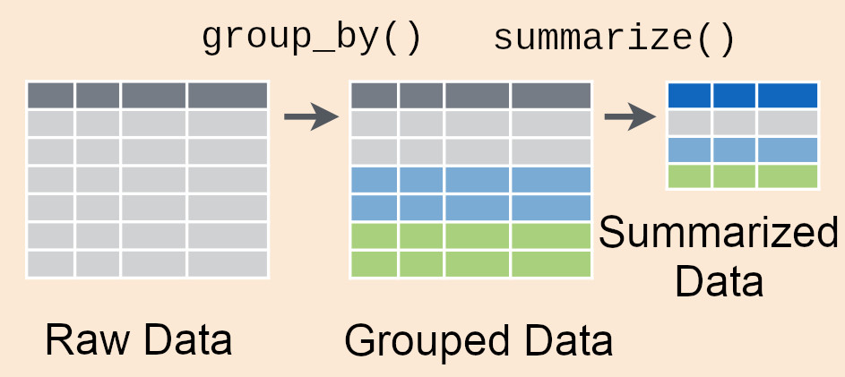

---
title: "Group-wise Summaries with dplyr"
author: "Will Hopper"
output:
  xaringan::moon_reader:
    lib_dir: libs
    nature:
      highlightStyle: github
      highlightLines: true
      countIncrementalSlides: false
      ratio: '16:9'
    css: ["default", "default-fonts", "../../assets/css/sds.css"]
editor_options: 
  chunk_output_type: console
---


```{r setup, include=FALSE}
knitr::opts_chunk$set("warning"=FALSE, "message"=FALSE, "fig.align" = 'center', "cache" = TRUE, dev='svg',prompt=FALSE)

library(dplyr)
```

### Functions are verbs in dplyr
The functions in the `dplyr` are named as data manipulation "verbs"

- "I want to choose some rows, and not others" --> `filter()`
- "I want to select only some columns" --> `select()`
- "I want to aggregate the data" --> `summarize()`
- "I want to divide the data into sub-groups" --> `group_by()`
- "I want to sort the rows" --> `arrange()`
- "I want to create a new column" --> `mutate()`
- "I want to find the unique rows" --> `distinct()`

???

Hello Statisticians! In this video, we're going to our tour of the dplyr package, which specializes in tools for manipulating data frames.

Last time, we were introduced to the idea of thinking about data manipulation functions as verbs describing actions you can take on the data, and went in depth with the filter function, which allowed us to choose some rows from our data for further analysis, and quite literally filtered out other rows.

---

### Summarizing Verbs
The functions in the `dplyr` are named as data manipulation "verbs"

<ul>
<li>"I want to choose some rows, and not others" --&gt; <code class="remark-inline-code">filter()</code></li>
<li>"I want to select only some columns" --&gt; <code class="remark-inline-code">select()</code></li>
<li class="remark-code-line-highlighted">"I want to aggregate the data" --&gt; <code class="remark-inline-code">summarize()</code></li>
<li class="remark-code-line-highlighted">"I want to divide the data into sub-groups" --&gt; <code class="remark-inline-code">group_by()</code></li>
<li>"I want to sort the rows" --&gt; <code class="remark-inline-code">arrange()</code></li>
<li>"I want to create a new column" --&gt; <code class="remark-inline-code">mutate()</code></li>
<li>"I want to find the unique rows" --&gt; <code class="remark-inline-code">distinct()</code></li>
</ul>


???

This time, we're going to focus on tools in the dplyr package which allow us to perform data aggregation, specifically the group_by and summarize functions. Together, these two functions are the killer features of the dplyr package, allowing us to perform calculations with just two simple lines of code instead of a dozen complicated ones.

---

### The `Titanic` data set

.pull-left[
Unit of observation: A passenger category

- `Class`: Indicates 1<sup>st</sup>, 2<sup>nd</sup>, or 3<sup>rd</sup> class status of the passengers.
- `Sex`: Recorded sex of the passengers, Male or Female
- `Age`: Age category of passengers, Adult or Child
- `No`:  Number of passengers in this category that did not survive
- `Yes`: Number of passengers in this category that survived
]

.pull-right[
```{r echo=-1}
Titanic <- filter(as.data.frame(Titanic), Class != "Crew") %>%
  tidyr::spread(Survived, Freq) 
Titanic
```
]

???

We're going to demonstrate how to use these two functions by applying them to a data set about survival rates from the famous Titanic shipwreck.

This data set contains information about how many people survived, and didn't survive the shipwreck, from several demographic categories. The people on board are classified by their Class, whether they were 1st, 2nd, 3rd class passengers or Crew Members, by their sex, and by their age, using just "Adult" and "Child" categories to measure age. So overall, we have 12 groups represented in this data set.

The number of people in a particular category who survived is given by the Yes variable, and the number of people who did not survive is given by the No variable.

---

### The `Titanic` data set

```{r eval=FALSE}
Titanic <- data.frame(Class = c("1st", "1st", "1st", "1st", "2nd", "2nd",
                                "2nd", "2nd", "3rd", "3rd", "3rd", "3rd"
                                ),
                      Sex = c("Female", "Female", "Male", "Male", "Female", "Female",
                              "Male", "Male", "Female", "Female", "Male", "Male"
                              ),
                      Age = c("Adult", "Child", "Adult", "Child", "Adult", "Child",
                              "Adult", "Child", "Adult", "Child", "Adult", "Child"
                              ),
                      No = c(4, 0, 118, 0, 13, 0, 154, 0, 89, 17, 387, 35),
                      Yes = c(140, 1, 57, 5, 80, 13, 14, 11, 76, 14, 75, 13)
                      )
```

???

If you want to follow along with these examples at home, here's the code you could run to create the `Titanic` data set in your own R session.

---

### Survival aboard the Titanic

We can use the `summarize` function to calculate how many people did and did not survived the sinking of the Titanic

???

The summarize function is useful whenever you want to answer a question that requires data aggregation, which is when you combine multiple observations from your data set together. One such question we might be interested in is 
how people did and did not survived the sinking of the Titanic.

--

`summarize` takes a data frame with many rows, and "boils it down" to a single row

.pull-left[

]

???

Right now, that information is spread across the 12 rows of the data frame - we need to combine observations across the rows in order to find the total number of surviving and deceased passengers, which we can do with the help of the summarize function. As I like to say, the summarize function takes a data frame with many rows, and "boils it down" to a single row.

--

.pull-right[

]

???

The `summarise` function itself is important for handling the logistics of the data frame shell which hold the data, but it doesn't do all the work alone. If you imagine zooming in on the small arrow between the data frame input with 3 rows, and the output with 1 row, you can see that the real heavy lifting of computing the summary value we want is performed by another function, a summary function. As you might imagine, a summary function is any function that takes many values as input, and produces a single value as its output. In this figure, the summary function takes in 4 values, and produces one single value as it's output.

The actual function being used is left ambiguous however, because the particular summary function you want to use depends on the particular question you want to answer about the data.

--

Since our question is "how many", and our measurements are survived/didn't survive counts, the summary function we want is `sum`

???

Since our question is "how many", and our measurements are survived/didn't survive counts, the summary function we want is the `sum` function.

---

### Survival aboard the Titanic

.center[
`summarise(Titanic, sum(No), sum(Yes))`
]

.pull-left[
```{r, echo=FALSE}
Titanic
```
]

???

Let's take a look at the code we need to write to find the total number of surviving and deceased passengers. Like all dplyr functions, the very first input is the name of the data frame which holds the observations we want to work on. So, the very first thing inside the parenthesis is `Titanic`.

After the data comes the summary functions. Since we can find the total number of deceased passengers by adding up all the values in the "No" column, we would write sum(No) to compute the total of all the values in that column. We would do the exact same thing with the yes column in order to calculate the total number of surveying passengers.

In this example, we're computing multiple summaries of the data - one summary of survivals, and one summary of deaths. You can compute as many summaries as you like, just write out each one separated with a comma.

Let's run this code, and see what the output looks like.
--

.pull-right[
```{r, echo=FALSE}
summarise(Titanic, sum(No), sum(Yes))
```
]

???

As we expected, out output is a data frame with one row in it. Further more, none of the variables from the Titanic data frame input are present in the output - the class, sex, and age variables are gone. Since the summaries we computed aren't tied to one particular category, like Adult First Class Females, it makes sense to get rid of those labels.

The variables we do have are the ones we explicitly computed - the sum of the "No" column, representing the total number of deceased passengers, and the sum of the 'Yes' columns, representing the total number of the deceased passengers. So, we've learned that there were 499 survivals, and 817 deaths in total.

---

### Survival aboard the Titanic

.center[
<code class="remark-inline-code">summarise(Titanic, <span class="remark-code-line-highlighted">N_deceased = </span>sum(No), <span class="remark-code-line-highlighted">N_survived = </span>sum(Yes))</code>
]

.pull-left[
```{r, echo=FALSE}
Titanic
```
]

.pull-right[
```{r, echo=FALSE}
summarise(Titanic, N_deceased = sum(No), N_survived = sum(Yes))
```
]

???

One thing we can do to make this output data frame a little bit easier to work with is give our new summary variables easy to work with names. As it stands, our column names are literally sum parenthesis Yes and sum parenthesis No. Special characters like parenthesis can break some R functions, so it's better to give each column a simpler name.

Here, I've named the column representing total deaths "N_deceased", short for number deceased, and the column representing total survivals "N_survived", short for number survived. To use these names instead of the defaults, put them to the left of the summary function, separated by an equal sign, just the way I created variables in the original Titanic data set back on slide 5 using the data.frame function.

Thanks to this, the columns in my output are named "N_deceased" and "N_survived", instead of sum(Yes) and sum(No)

---

### Summarizing sub-groups in the data

Let's get more fine-grained - How many males and females survived/didn't survive?

--

What we want is one row for males, and one row for females, in the output from `summarize`

???

Looking ahead to the final results, what we want is one row representing males, and one representing for females, in the output from the `summarize` function. In other words, we want to keep all 6 observations pertaining to male passengers separate from the 6 observations pertaining to female passengers when computing the sums of the Yes and No variables.

This doesn't seem possible at first glance - the summarize function takes many rows, and boils them down to one row. But now, we want it to take many rows, and boil them down to two rows. How can we make this happen

--

.center[

]

---

### The Magic of `group_by`

All we need to do is tell R to "group" the `Titanic` data according to the `Sex` variable!

.center[
`group_by(Titanic, Sex) %>% summarise(sum(No), sum(Yes))`
]

.pull-left[
```{r echo=FALSE}
Titanic
```
]

--

.pull-right[
```{r echo=FALSE}
group_by(Titanic, Sex) %>% summarise(sum(No), sum(Yes))
```
]

---

### The %>% pipe operator

The `%>%` operator has one job: take the output from the left hand side, and send it to the function on the right had side as input.

--

.pull-left[
So this...
```{r eval=FALSE}
group_by(Titanic, Sex) %>%
  summarise(sum(No), sum(Yes))
```
]

.pull-right[
...is is a cleaner way of writing this
```{r eval=FALSE}
summarise(group_by(Titanic, Sex),
          sum(No), sum(Yes))
```
]

--

Note how the the data frame argument moves: one the left, it is "piped" in. On the right, it is written inside the parenthesis of the `summarise` function using the "traditional" fashion.

--

You can read the `%>%` out loud as "then"

???

One way to understand the pipe operator is to think of it like the word "then" in a sentence. So, we could narrate our code verbally by saying "group the rows of the titanic data frame by the Sex variable, **then** summarize the data by adding up the Yes and No variables.

---

### Multiple sub-groups

We're free to group by multiples variables - now the groups are defined by *unique combinations* of variables

.center[
`group_by(Titanic, Sex, Class) %>% summarise(sum(No), sum(Yes))`
]

.pull-left[
```{r echo=FALSE}
Titanic
```
]

???

We're free to group our data by as many variables as we want - we can add variables to the list of things to group by by putting another comma, then the name of the next variable to group by. Now, the groups of rows are defined by the *unique combinations* of variables
--

.pull-right[
```{r echo=FALSE}
group_by(Titanic, Sex, Class) %>% summarise(sum(No), sum(Yes))
```
]

---

### How to know when to group?

There are many natural language synonyms for `group_by()`

???

The code for creating group-wise summaries with dplyr is easy - what's hard is knowing when you need to group the data before doing some operations, and what variables you should group by. This takes a little experience quote on quote "thinking statistically", but here are some signposts you can use as you get more seasoned:

--

If you hear sentences like:

- "Separate out A and B"
- "Condition on A and B"
- "Group the data by A and B"
- "Give a break down by A and B"

you should be thinking `group_by(data, A, B)`

???

If you hear sentences like "Separate out A and B", "Condition on A and B", "Group the data by A and B", or "Give a break down by A and B", you should be thinking `group_by(data, A, B)`

--

We could have described our work on Slide 12 as "Breaking the data down by Sex"

???

For example, back on slide 12 we grouped the data by just the Sex variable, and we could have described that as  "Breaking the data down by Sex".

---

### How to know when to group?

There are many natural language synonyms for `group_by()`

If you hear sentences like:

- "Collapse over A and B"
- "Aggregate across A and B"
- "Pool across A and B"

you should be thinking "I need to leave A and B **out** of the `group_by` I use"

--

We could have described our work on Slide 12 as "Collapsing the data over Class and Age"

???

Again, taking slide 12 as an example, we  could have described grouping the data by sex as "Collapsing the data over Class and Age", because those variables were "collapsed" and didn't appear in the final summary.

---

### Recap

- The `summarize` function, together with a "summary function", allows you to take a data frame with many rows, and "boil it down" to one value

--

- Grouping the rows of the data frame with `group_by` first allows you to compute one summary value per unique group
--

- The `%>%` operator sends the output from one function into the next function as input
  - Frequently use to link `dplyr` functions in a "pipeline"
--

- Words like "Break down by", "Collapse over" or "Aggregate by" are key words telling you "I should by using `summarize`, and probably `group_by` as well".


