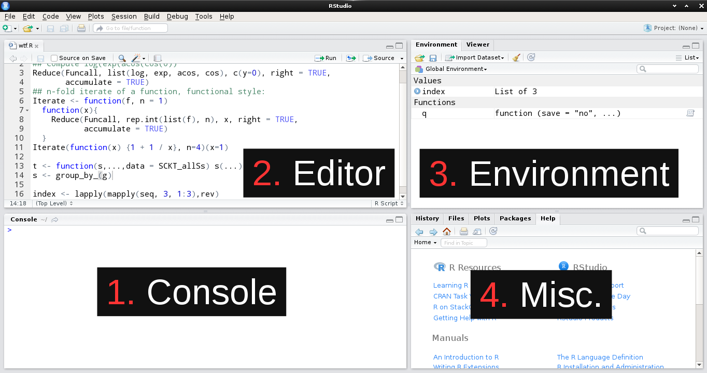
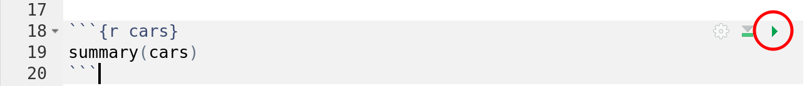
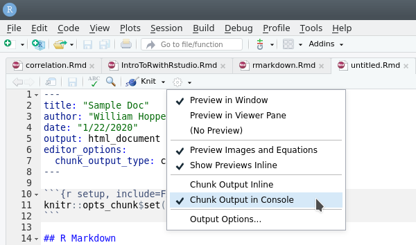
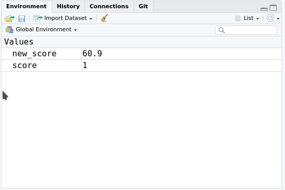
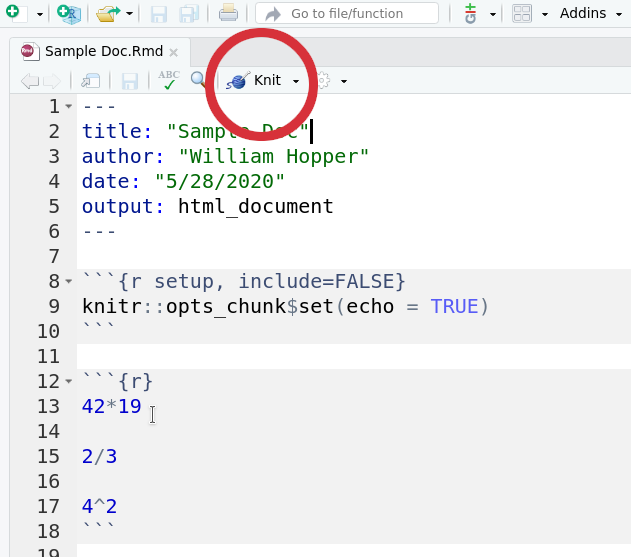
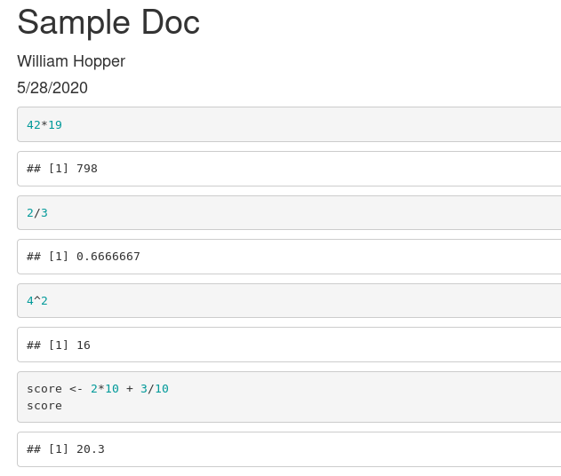
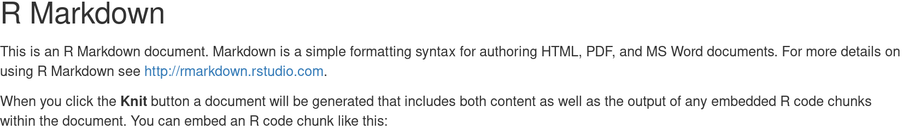

```{r setup, include=FALSE}
knitr::opts_chunk$set(cache = TRUE)
root_dir <- rprojroot::is_rstudio_project$find_file()
```


### The R Language

- R is a programming language and computing environment specialized for statistical analysis, data manipulation and reporting.
- We can use it to perform statistical tests, create data visualizations, connect to databases, write files to the hard drive, etc...
- Despite its focus being data and statistics, it is still very feature rich, and relatively easy to learn, as far as programming languages go. 

---
### Rstudio 

- Rstudio is a graphical front end that simplifies common tasks, prettifies things, and makes it easier to use R. 
- Rstudio is like a workbench and toolbox, where R is like a hammer. 
    - It certainly is possible for you to use your hammer to build something *without* a workbench and toolbox
    - But it's nice to have the workbench to rest things on while you work, and to have the toolbox holding your nails right next to your hammer, etc.

???

ModernDive gives the analogy that R is like your car's engine, while RStudio is like the interior dashboard. Your car isn't functional without its engine, but having a speedometer, and turn signals, and windshield wipers makes your job of driving the car much much easier.

---

### The Rstudio IDE*

.noverticalmargin[


*Integrated Development Environment
]

---

### 1: The Console

The console pane allows interactive use of the R interpreter
  - The R interpreter is the program on your computer that listens to incoming R commands (called *expressions*), evaluates them, and gives you back a result or an error.
    
You type input at the prompt (the `>` symbol), press Enter, and any output is printed below the command

--

Try out several basic mathematical operations

- `+` = addition
- `-` = subtraction
- `/` = division
- `*` = multiplication
- `^` = power of

---

### 2: The Editor

The editor pane is where you can create, modify, and save plain text documents.

We're going to be using the editor to write **R Markdown documents**.

--

R Markdown documents contain formatted "human" language (e.g., a sentence with italics, or a bulleted list), 

They can also contain R code that you can run, and it's output will be inserted along with your "human" readable text.

--

Think of them a bit like a Word document that has an R console built into it!
  - The final product of our work is a typeset PDF or HTML document explaining all of our work and showing all of our results.

---

### R Markdown

Let's see our first example!


---

### The YAML Header
The title and author information we entered have been inserted in the **YAML Header**
```yaml
---
title: "Sample Doc"
author: "William Hopper"
date: "5/26/2020"
output: html_document
---
```

The YAML header is there to tell the R interpreter information about how to render the final output document. For example, the `output: html_document` option tells interpreter to construct an HTML document (as opposed to a PDF).

---

### R Code Chunks

Below the YAML header, you'll see the following block of lines with a grey background:

.hljs[
````
```{r setup, include=FALSE}`r ''`
knitr::opts_chunk$set(echo = TRUE)
```
````
]

This is an **R Code chunk**. All the R code that you want to be run need to go inside these special chunks. R Code chunks are defined by 3 things

1. Three backticks at the start of a line
2. The lowercase letter r inside curly braces immediately after the three backticks
3. Three more backticks on another line

The code chunk can optionally have a name (the chunk above is named `setup`) and specify any *chunk options*. The chunk above has the option `include=FALSE`. This option tells R to not display the code itself or any of it's result in the output document.

---

### R Code Chunks

Let's insert a brand new R chunk, and write the code for a few simple mathematical operations

.hljs[
````
```{r setup, include=FALSE}`r ''`
42*19

2/3

4^2
```
````
]

---

### Interactively Running R Code Chunks
We can run the code inside the code chunks "interactively" in several different ways

You can run **a single line** by placing your cursor on a line and pressing <kbd class="key">Ctrl</kbd> + <kbd class="key">Enter</kbd> on a PC, or <kbd class="key">&#8984;</kbd> + <kbd class="key">Enter</kbd> on a Mac.

--


You can run **multiple lines** by highlighting the lines of code you want to run, and pressing <kbd class="key">Ctrl</kbd> + <kbd class="key">Enter</kbd> on a PC, or <kbd class="key">&#8984;</kbd> + <kbd class="key">Enter</kbd> on a Mac.

--


You can run **all the code in a chunk** by pressing the green "run" arrow in the top right corner of the chunk.



---

### Inline vs. Console output
By default, the results from running R Code chunks interactively are shown in the editor window, just below the code itself.

If you like this, great. If you don't, you can get output to show "normally" in the console by clicking the gear icon next to the "Knit" button, and selecting "Chunk Output in Console" instead of "Chunk Output Inline".

.center[]

---


### Coding in the console or the editor??

Think of the console as a quick calculator, or a piece of scratch paper
  - Use it for doing simple calculations, or testing out an idea
    
--

Think of the code in the editor as a "recipe" for things you want to easily repeat
  - So, if you are doing a task with multiple steps and want to save your work for later use, write an R script!
  - And don't leave all your scratch code in your recipe!

---

### Variables: Save your work!
Using a programming language like R to do your data analysis means you can save the results of your computations and use them again and again without running the code every time.

You can store information for later use in **variables** (also called **objects**)

Variables in R are similar to variables from algebra: they are named stand-ins representing some piece of information
  - But in R, your variables can be much more than just a number
  
---

### 3: Object Examples
.noverticalmargin[
Variables are always created using the **assignment operator**, written `<-`. Let's run the expression `2*10 + 3/10`, and save the results in an variable called `score`.
```{r assigment1}
score <- 2*10 + 3/10
score
```

Now we can use the variable `score` as a stand-in for the value `20.3` anywhere we want!.
```{r assignment2}
new_score <- score * 3 # same as 20.3 * 3
new_score
```

We can change the value of the object `score`, but it doesn't affect the object `new_score`.
```{r assignment3}
score <- 1
new_score
```
]

---

### The Environment Pane
.pull-left[
You might have noticed something happening in the top-right panel as you ran those lines of code - something has appeared in our Environment pane!

The Environment pane shows us the name of each variables we've created during our our R session, as well as some information about their value

]
.pull-right[

]

---

### Knitting an output document
Usually we don't analyze data solely for our own consumption - we usually want to share the results of what we've done with someone else.

The best way to do this is by "knitting" your R Markdown document to produce an output document, like a PDF or HTML file that has your text, code, and results in it.

---

### Knitting an output document

.pull-left[
Pressing the "Knit" button...

]

.pull-right[
...produces this HTML file!

]

???

I have set up my RStudio to open it in the bottom left pane; yours will probably open up in a new window.

You can change this if you want by going to Tools --> Global Options --> R Markdown --> Show output preview in "Viewer Pane".

Open up the folder where you saved it, double click.

All the R Code and it's output has been inserted into the document! You can also see that you can insert plots into your R Markdown output.

---

### Styling Text with Markdown

Around each of the code chunks in the document you'll see text describing what is being done. But you'll also see that there are some special character scattered throughout as well.

For example, a few lines start with two pound-signs and then a space. And the word "knit" has two asterisks at the beginning and the end, with no spaces. What are these doing here?

These special character sequences are examples of **Markdown** formatting, and they are essentially a simplified way to specify how some elements in the document should appear. If you open the HTML file you created as output in a web browser, you'll see that the lines starting the two pound-signs appear as larger section titles, while "knit" has been bolded.

<span class="center">

</span>

---


### Why R Markdown?

R Markdown documents solve the awkward problem of having our work (e.g., R code we've written to answer a HW problem) separated from the reporting of our solution (e.g., the HTML file we upload on Moodle).

By keeping everything in one document, your work and your answers are naturally kept in sync.

R Markdown documents hold both your computations, and your story.

There is a lot to learn about about R Markdown, and you don't *have* to use R Markdown documents to code in R, but it's absolutely worth it to learn.

---

### Further Reading and Examples

- [An Introduction to RMarkdown](https://rmarkdown.rstudio.com/lesson-1.html) (very thorough)
- [A Quick-Reference guide](https://www.rstudio.com/wp-content/uploads/2015/03/rmarkdown-reference.pdf) (keep this handy, also see Help --> Markdown Quick Reference in RStudio!)
- [Chunk Options Documentation](http://yihui.name/knitr/options/) (Don't be overwhelmed, you can probably get 90% of things you need done with about 20% of the options)
- [My Self-Documenting Example](https://raw.githubusercontent.com/wjhopper/psych640-labs/gh-pages/data/rmarkdown_example.Rmd) (good for trying things out)

---

### 4: Miscellaneous | Tabs to know

- History: List of commands you've given
    + Double click to re-run
- Plots: Tab where graphics are displayed after they are made/"printed"
- Packages: List of installed and loaded packages
    + Groups of additional commands you can load into R
    + Checked = loaded
- Help: Documentation on R functions
    + `?mean`
