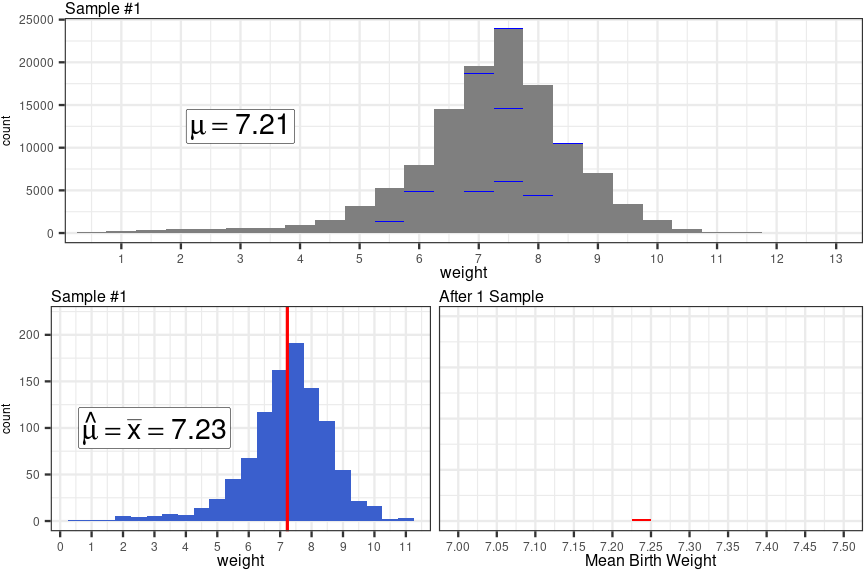
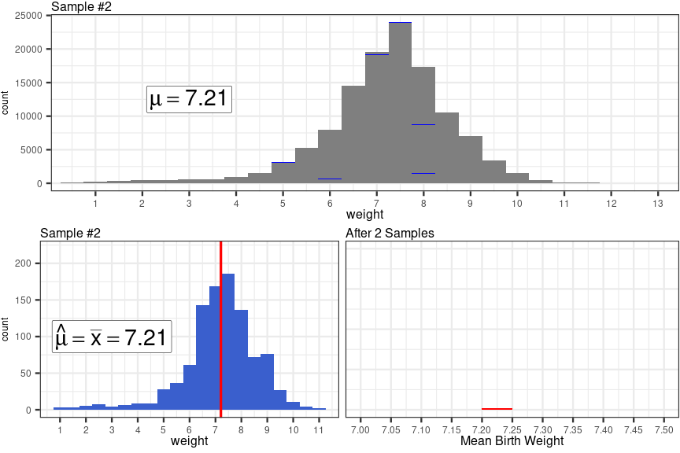
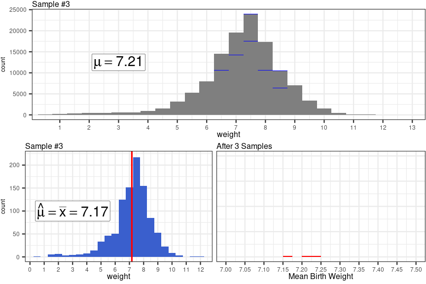
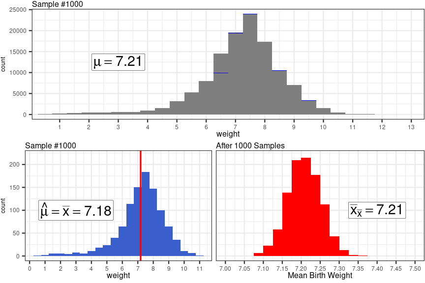
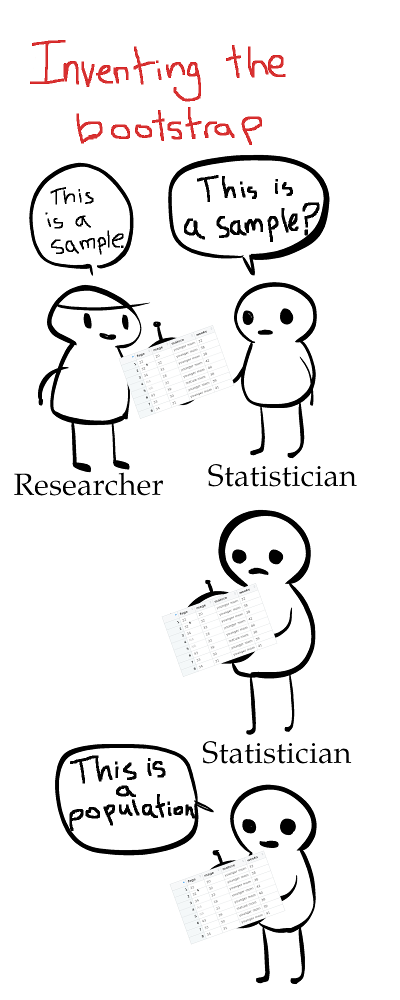

```{r setup, include=FALSE}
library(moderndive)
library(ggplot2)
library(gganimate)
library(grid)
library(gridExtra)
library(dplyr)
library(purrr)
library(tidyr)

options(htmltools.dir.version = FALSE, stringsAsFactors = FALSE)
knitr::opts_chunk$set(echo = FALSE, cache=TRUE, fig.align = 'center')
theme_set(theme_bw(24) +
            theme(plot.margin = margin(12,1,1,1),
                  legend.box.margin = margin(0,0,0,-20),
                  plot.title = element_text(size=16, margin = margin(-10)),
                  plot.subtitle = element_blank()
                  )
          )

ncbirths <- read.csv("../../data/ncbirths.csv", stringsAsFactors = FALSE) %>%
  dplyr::filter(!is.na(weight), !is.na(weeks), !is.na(smoker))

ncbirths_population <- read.csv("../../data/ncbirths_population.csv", stringsAsFactors = FALSE) %>%
  filter(!is.na(weight))
```

### Previously: 3 methods for constructing a sampling distribution

- CLT Exact: Perform a census to find $\mu$ and $\sigma^2$, apply CLT to find mean, variance and shape of sampling distribution
- Manual: Collect many samples of size $N$ from the population, compute mean of each one
  - From there, the mean of means and variance of means estimates $\mu_{\bar{x}}$ and $\sigma^2_{\bar{x}}$
- CLT Estimation: Collect one sample, use sample mean and sample variance $\bar{x}$ and $s^2$ to estimate $\mu$ and $\sigma^2$, use those estimates in the CLT formulas

???

At the end of the last lecture, we recapped our three techniques for constructing a sampling distribution.

---

### Previously: 3 methods for constructing a sampling distribution


- CLT Exact: Perform a census to find $\mu$ and $\sigma^2$, apply CLT to find mean, variance and shape of sampling distribution
.grey[
- Manual: Collect many samples of size $N$ from the population, compute mean of each one
  - The mean of means and variance of means estimates $\mu_{\bar{x}}$ and $\sigma^2_{\bar{x}}$
]
- CLT Estimation: Collect one sample, use sample mean and sample variance $\bar{x}$ and $s^2$ to estimate $\mu$ and $\sigma^2$, use those estimates in the CLT formulas

???

At the end of the last lecture, we recapped our three technique for constructing a sampling distributions.

The first method and the third method shown here both make use of the central limit theorem to construct the sampling distribution.

--

Recall that the CLT tells us:

- The mean of sample averages, $\mu_{\bar{x}}$, is equal to the mean of the population, $\mu$
- The variance of sample averages, $\sigma^2_{\bar{x}}$, is equal to the variance of the population, $\sigma^2$, divided by the sample size $N$
- The shape of the sampling distribution will be a normal distribution

???

 To remind you, the central limit theorem tells us three things

- The mean of sample averages, $\mu_{\bar{x}}$, is equal to the mean of the population, $\mu$
- The variance of sample averages, $\sigma^2_{\bar{x}}$, is equal to the variance of the population, $\sigma^2$, divided by the sample size $N$
- and finally, we know the shape of the sampling distribution will be a normal distribution

This last point, that the sampling distribution will be exactly normal, is a very strong assumption to make, and sometimes, there can be small deviations from normality in the sapling distribution which can make future computations slightly less accurate.

---

### Previously: 3 methods for constructing a sampling distribution

.grey[
- CLT Exact: Perform a census to find $\mu$ and $\sigma^2$, apply CLT to find mean, variance and shape of sampling distribution
]

- Manual: Collect many samples of size $N$ from the population, compute mean of each one
  - The mean of means and variance of means estimates $\mu_{\bar{x}}$ and $\sigma^2_{\bar{x}}$

.grey[
- CLT Estimation: Collect one sample, use sample mean and sample variance $\bar{x}$ and $s^2$ to estimate $\mu$ and $\sigma^2$, use those estimates in the CLT formulas
]

???

So far, only the second method here, the manual method, doesn't require that you make any assumptions as part of your work - you just construct a sampling distribution by collecting sample after sample, and finding the mean of each one. In other words, to estimate the effects of sampling variability on the sample mean, you quite literally observe the effects of sampling variability on the sample mean.

However, I also mentioned this approach was almost never possible, because there are almost no situations where you have both the time and resources necessary to collect thousands of separate samples. So, it wasn't really possible to use this assumption-free technique.

--

- Manual method can be approximated using the "Bootstrap" method, which *is* a feasible technique

???

This leads us to the main topic of today's video, the bootstrap, which will allow us to have our cake and eat it too. The Bootstrap will allow us to construct an estimate of the sampling distribution without making strong assumptions, *and* we'll be able to do it using only a single sample of data.

---


### Previously: Repeatedly sampling from the *population*




???

Since the Bootstrap method is so similar to the Manual method we explored via simulation a few lectures ago, it's worth revisiting how the process of manually constructing the sampling distribution unfolded.

We started with the entire population, all 120,000 or so babies born in North Carolina in 2004, and we randomly selected 1,000 babies from the population {draw arrow from pop to sample}. We observed their weights, computed the mean weight of all 1,000 babies, and saved that mean for later {draw arrow from sample to sampling distribution}

---

### Previously: Repeatedly sampling from the *population*



???

We continued this process by sampling 1000 new babies, finding their average weight, and saving the average again {draw a second set of arrows}

---

### Previously: Repeatedly sampling from the *population*



???

and we did it again, and again, and again {draw a third set of arrows}

---

### Previously: Repeatedly sampling from the *population*



???

We repeated this process 1,000 times, until we had collected 1,000 total samples, and saved up 1,000 sample means {draw x1000 by arrows}

This final result, the distribution in the bottom right, was our sampling distribution. Here we directly observed the effects of sampling variability on the sample mean - some means were a bit higher than the population average mu, some were a bit lower than the population average, but overall most of them were quite close.

With this process finished, we can use this distribution to inform our expectations about what average birth weights are likely to be observed in North Carolina in 2004, and which aren't.

However, we were able to construct this distribution because we were able to quickly and efficiently collect 1,000 independent samples - we had the entire population loaded into R, and could use a computer to quickly take sample after sample.

If we were facing this problem is real life, we probably wouldn't be able to do this. In fact, we'd probably only be able to collect a single sample of data. {erase all but one of the pop to sample arrows}. But thanks to Bootstrap re-sampling, we can still construct a sampling distribution of 1,000 different means, using just the observations in this single sample.

---

### Bootstrap Re-sampling Procedure

.pull-left[
1. Collect a sample of $N$ observations
{{content}}
]

.noverticalmargin.pull-right[
```{r out.height="600px", out.width="320px", echo=FALSE}

```
]

???

The Bootstrap is actually remarkably simple, yet profound technique. As I mentioned, you start with just a single sample of data. The logic is that since you already consider your sample representative of the population, you take that idea to it's natural conclusion and treat your sample as if it WAS the population.

--

2. Randomly re-sample $N$ observations from your original sample *with replacement* (i.e., use your first data set to make a second!)
{{content}}

???

So, to collect the many different samples you're after, you randomly re-sample the observations from your original sample *with replacement* - think of it like place all your observations in a bag, drawing one out, writing down it's value and putting it back in the bag, and repeating this until you have a second data set based on your first


--

3. Compute the mean of your re-sampled observations, save it
{{content}}

???

Then take the mean of your second, new data set, save it

--

4. Repeat as many time as desired - you now have a bootstrapped sampling distribution

Basically, you treat your sample as a mini population, and sample from it again and again!

???

Then you repeat this process again and again until you've got enough means for a sampling distribution. To summarize it briefly, you treat your sample as it's own mini population, and sample from it again and again!

---

class: smaller-code
layout: false


### Sampling vs Re-sampling (bootstrapping)

```{r, echo=TRUE, eval=FALSE}
ncbirths_population <- read.csv("https://wjhopper.github.io/SSW-858/data/ncbirths_population.csv",
                                stringsAsFactors = FALSE) %>%
  filter(!is.na(weight))
```

???

Here's an example of how we might do this in R. We'll start by importing the full population of north carolina births, removing any missing birth weight observations using dplyr's filter function.

--

.pull-left[
#### Sampling
```{r, echo=-1, R.options=list(digits=3, tibble.width=40), warning=FALSE}
set.seed(10)
sampling_dist <-
  select(ncbirths_population, weight) %>%
  rep_sample_n(size=500, reps=1000) %>%
  group_by(replicate) %>%
  summarise(avg_weights = mean(weight))

glimpse(sampling_dist)
```
]

???

Let's start by referring back to how we would estimate the sampling distribution using many samples from the population, and then we'll compare this technique with the new bootstrap method.

The first thing I've done is select just the weight column, since that's the only variable I'm interested in. You don't have to do this step, but I like doing because it makes it a bit more clear what we're sampling.

Then I use the rep_sample_n function from the moderndive package to collect 1000 different samples of 500 birth weights. The individual sample each weight belongs to is encoded by the replicate column, so to find the mean birth weight of each individual sample, I first group the data frame by the replicate column, and use the summarise function from dplyr to find the 1,000 average birth weights. We can see the first few average birth weights by taking a glimpse of the sampling_dist data frame.

--

.pull-right[
#### Re-sampling (bootstrapping)
```{r, echo=-1, R.options=list(digits=3, tibble.width=40)}
set.seed(11)
one_sample <- 
  select(ncbirths_population, weight) %>%
  rep_sample_n(size=500, reps=1) %>%  #<<
  ungroup()

bootstrap_dist <-
  select(one_sample, weight) %>%
  rep_sample_n(size=500, reps=1000,
               replace = TRUE) %>% #<<
  group_by(replicate) %>%
  summarise(avg_weights = mean(weight))

glimpse(bootstrap_dist)
```
]

???

The process is similar for the bootstrap, with two important differences. The first step we take is to collect one single sample of birth weights, which I've done using the rep_sample_n function by setting the reps argument to 1, and I've saved the 500 randomly selected birth weights in the `one_sample` data frame

Then, I use the rep_sample_n function again to re-sample from the original set of 500 birth weights, collecting 1000 additional re-samples of 500 birth weights. Using `replace=TRUE` tells R to never remove an observation from the pool of weights that it has to sample from. This is crucial, because if we removed each birth weight after re-sampling it, we would just get back our original sample in the end, meaning there would be no sampling variability and thus no sampling distribution to speak of.

We see that in the end, the bootstrap technique gives us same type of thing: 1,000 different average birth weights.
---

class: smaller-code, wider

### Sampling vs Re-sampling (bootstrapping)

.pull-left[
```{r echo=TRUE, fig.height=6}
ggplot(sampling_dist, aes(x=avg_weights)) +
geom_histogram(binwidth=.025, fill="red") +
ggtitle("Sampling distribution")
```
]

.pull-right[
```{r echo=TRUE, fig.height=6}
ggplot(bootstrap_dist, aes(x=avg_weights)) +
geom_histogram(binwidth=.025, fill="forest green") +
ggtitle("'Bootstrapped' sampling distribution")
```
]

???

Let's plot the sampling distribution, and the bootstrap approximation to the sampling distribution, for comparison. It appears our bootstrap gives us a fair estimate estimate of the sampling distribution. It's mean appears to be slightly larger, telling us that our original sample mean was a bit larger than the population mean, and it appear to have a slight positive skew which deviates from normality somewhat.

So, there you have it, we've bootstrapped our way into a sampling distribution, by repeatedly re-sampling our original 500 observations, and learned a tractable approach for estimating the sampling distribution of the mean that doesn't rely on the central limit theorem.

---

class: wider

### 4 methods for constructing a sampling distribution

        
<table id="sampling-dist-methods">
  <thead>
    <tr>
      <th style="text-align:center"></th>
      <th style="text-align:center">Using the C.L.T.</th>
      <th style="text-align:center">Manually (e.g., simulations)</th>
    </tr>
  </thead>
  <tbody>
    <tr>
      <td style="text-align:center">Using entire population</td>
      <td>
        <ul>
          <li>Perform a census to find \(\mu\) and \(\sigma^2\) <span style="font-style: italic;">exactly</span></li>
          <li>Apply the Central Limit Theorem (assuming samples of \(N\) observations)</li>
        </ul>
      </td>
      <td>
        <ul>
          <li>Collect <span style="font-style: italic;">many</span> samples of \(N\) observations</li>
          <li>Find the mean of each sample</li>
          <li>Find the mean of means and the variance of means</li>
        </ul>
      </td>
    </tr>
    <tr>
      <td style="text-align:center">Using a single sample</td>
      <td>
        <ul>
          <li>Collect <span style="font-style: italic;">one</span> sample of \(N\) observations</li>
          <li>Use sample mean to <span style="font-style: italic;">estimate</span> \(\mu\) and \(\sigma^2\)</li>
          <li>Apply the Central Limit Theorem using your estimates and sample size</li>
        </ul>
      </td>
      <td>
        <ul>
          <li>Collect <span style="font-style: italic;">one</span> sample of \(N\) observations</li>
          <li>"Bootstrap": Collect many re-samples of size N</li>
          <li>Find the mean of each re-sample</li>
          <li>Find the mean of means and the variance of means</li>
        </ul>
      </td>
    </tr>
  </tbody>
</table>

???

Let's add the bootstrap method to the set of techniques we've learned for constructing a sampling distribution. To help you conceptually organize them, I've described these methods in  table which divides them up according to what set of observations your rely on to construct the distribution, the entire population or a single sample, and whether you construct the distribution using the Central Limit Theorem to determine it's properties, or manually construct it by computing many different sample means.

Only by performing a census can we ever know the true sampling distribution, but performing a census is unrealistic in nearly every situation, and would also render the sampling distribution moot - the reason to care about the sampling distribution is because of sampling variability, and if you don't have to take samples, then you don't really have to care care about the sampling distribution! So let's cross this one off.

But even if knowing the exact truth may be impossible, we still have options, as the other three techniques in this table are ways of estimating the true sampling distribution {draw arrows}

---

class: wider

### 4 methods for constructing a sampling distribution

```{r warning=FALSE, fig.height=7.5, fig.width=14, dev='svg'}
mu <- mean(ncbirths_population$weight)
sigma_sq <- var(ncbirths_population$weight)

mu_hat <- mean(one_sample$weight)
sigma_sq_hat <- var(one_sample$weight)

grid.newpage()
x1 <- grid.text("Using\nentire\npopulation", x=.5, y=.5,
         gp=gpar(fontsize=16, col="black"),
         draw = FALSE)

theme_set(theme_get() +
          theme(plot.title = element_text(size=16, margin = margin(-10)),
                axis.title.x = element_text(size=16, margin = margin(b=5)),
                axis.text.x = element_text(size=12),
                axis.text.y = element_blank(),
                axis.title.y = element_blank(),
                axis.ticks.y = element_blank())
          )
CLT_exact <-
  ggplot(data.frame(x=seq(7, 7.5, .1)), aes(x=x)) +
  stat_function(fun = dnorm, args = list(mean=mu, sd=sqrt(sigma_sq/500)),
                color="red", size=2
                ) +
  scale_x_continuous(limits=c(6.975,7.5)) +  
  ggtitle("Exact Sampling distribution via CLT") +
  theme(axis.title.x = element_blank())

grid.newpage()
x2 <- grid.text("Using a\nsingle\nsample", x=.5, y=.5,
         gp=gpar(fontsize=16, col="black"),
         draw = FALSE)

sampling_dist_plot <-
  ggplot(sampling_dist, aes(x=avg_weights)) +
  geom_histogram(binwidth=.025, fill="red") +
  scale_x_continuous("Average Birth Weight", limits=c(6.975,7.5)) +
  ggtitle("Sampling distribution estimated by repeated sampling") +
  theme(axis.title.x = element_blank())


CLT_estimate<-
  ggplot(data.frame(x=seq(7, 7.5, .1)), aes(x=x)) +
  stat_function(fun = dnorm, args = list(mean=mu, sd=sqrt(sigma_sq/500)),
                color="red", alpha=.1, size=2
                ) +
  stat_function(fun = dnorm, args = list(mean=mu_hat, sd=sqrt(sigma_sq_hat/500)),
                color="forestgreen", size=2
                ) +
  scale_x_continuous("Average Birth Weight", limits=c(6.975,7.5)) +
  ggtitle("Estimated Sampling distribution via CLT")

bootstrap_dist_plot <-
  ggplot(bootstrap_dist, aes(x=avg_weights)) +
  geom_histogram(binwidth=.025, fill="red", data = sampling_dist, alpha=.1) +
  geom_histogram(binwidth=.025, fill="forestgreen") +
  scale_x_continuous("Average Birth Weight", limits=c(6.975,7.5)) +
  ggtitle("'Bootstrapped' sampling distribution")

grid.arrange(x1, CLT_exact, sampling_dist_plot, x2, CLT_estimate, bootstrap_dist_plot, ncol=3, widths=c(.1, .45, .45))
```

???


I've also constructed a visual representation of these four methods as applied to the north carolina birth weights. In the top left we have the true sampling distribution, which is a normal distribution whose mean and variance were obtained by performing a census to learn the population mean and variance, and then applying the central limit theorem to construct the sampling distribution.

Below it, the green normal distribution shows an estimate of the true sampling distribution based on collecting a single sample of 500 birth weights, using the sample mean and variance to estimate the population mean and variance, and then applying the central limit theorem to construct the sampling distribution. I've left the true sampling distribution in the background to remind ourselves of what distribution this method is estimating.

In the top right, we have the manually constructed sampling distribution we saw back on slide 11, and below it we have the bootstrapped estimate of that sampling distribution. And for reference, I've left the red sampling distribution in the background to remind us what the bootstrap method is designed to estimate.

All right statisticians, that's all for today's video. Next time, we'll be putting our two green distributions to work estimating confidence intervals that summarize what the sampling distribution tells us about sampling variability. So, I'll see you in the next one.
