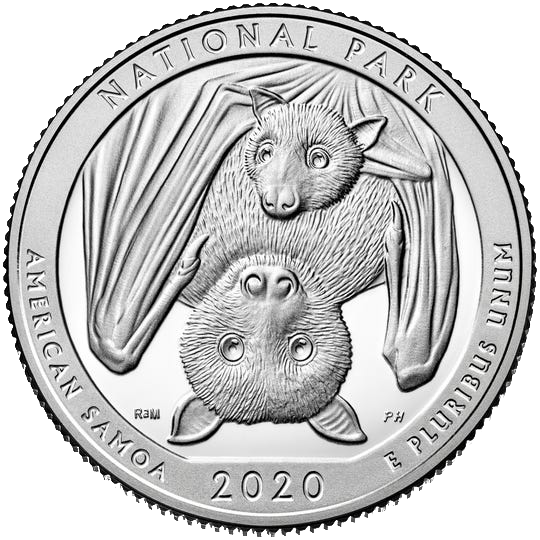

<style>
.grey124 li {
  color: #e8e8e8;
}
.grey124 li:nth-child(3), .grey124 li:nth-child(3) li {
  color: black;
}
</style>

```{r setup, include=FALSE}
library(moderndive)
library(infer)
library(ggplot2)
library(gganimate)
library(grid)
library(gridExtra)
library(dplyr)

options(htmltools.dir.version = FALSE, stringsAsFactors = FALSE)
knitr::opts_chunk$set(echo = FALSE, cache=TRUE, fig.align = 'center', dev='svg', fig.height=6, fig.width=8)
theme_set(theme_bw(24) +
            theme(plot.margin = margin(12,1,1,1),
                  legend.box.margin = margin(0,0,0,-20),
                  plot.title = element_text(size=16, margin = margin(-10)),
                  plot.subtitle = element_blank()
                  )
          )
```


```{r}
set.seed(1)
males <- data.frame(gender = "Male", age = c(69, 70, 71, 72, 73, 73, 76, 80))
females <- data.frame(gender = "Female", age = c(67, 74, 75, 77, 77, 81, 81))
life_exp <- as_tibble(bind_rows(females, males))
```


### Last time: Hypothesis Tests Logic
Do males and females have different average life expectancies?

1. Two conflicting hypothesis are pit against one another: $H_0$ vs. $H_A$
  - $\mu_F - \mu_M = 0$ vs. $\mu_F - \mu_M \ne 0$
2. Collect a sample, and compute a test statistic
  - $\bar{x}_F - \bar{x}_M = 3$
3. Construct a distribution of possible statistics **assuming the null hypothesis were true**
  - This process is detailed in the next video
4. Compare the observed test statistic (3) to the null hypothesis distribution
  - If the test statistic is extreme enough, we **reject the null hypothesis**
  - If the test statistic falls within the bounds of typical random fluctuations we **fail** to reject the null


???

Hello Statisticians. Today, we're picking up where we left off with hypothesis testing. In the last video, we introduced the logic of hypothesis testing, so that we could try to answer the question: do males and females have different average life expectancies?

Our approach to answering this question was to set up two conflicting hypothesis, the null and alternative. The Null hypothesis represented the belief that males and females have the same average life expectancy, which we represented symbolically with mu F minus mu M. The alternative represented the idea that males and females have different average life expectancy, by setting mu F minus mu M to something not 0.

We had a sample of 8 male and 7 female life expectancies from some newspaper obituaries, and observed that the average female lived 3 years longer than the average male. This test statistic, 3 years, is the evidence we have *against* the null hypothesis. But, to determine whether this evidence is strong enough for us to abandon the null hypothesis, or reject it in other words, we need to know the distribution of test statistics that could be observed assuming the null was true. 

In other words, we need to construct the null hypothesis distribution.

---

### Hypothesis Tests Outline

.grey124[

1. Two conflicting hypothesis are pit against one another: $H_0$ vs. $H_A$
  - $\mu_F - \mu_M = 0$ vs. $\mu_F - \mu_M \ne 0$
2. Collect a sample, and compute a test statistic
  - $\bar{x}_F - \bar{x}_M = 3$
3. Construct a distribution of possible statistics **assuming the null hypothesis were true**
  - Randomly permute category labels of the observations many times, computing category difference each time
4. Compare the observed test statistic (3) to the null hypothesis distribution
  - If the test statistic is extreme enough, we **reject the null hypothesis**
  - If the test statistic falls within the bounds of typical random fluctuations we **fail** to reject the null
]

???

This time, we're going to explore one technique for constructing this distribution, called the permutation method, or the permutation test.

Using the permutation method, we create a distribution of so-called "null" differences in sample means by randomly permuting the category labels of the observations many times, and computing the difference between the means of each category each time we "shuffle" the data.

---

### Hypothesis Tests Outline

We seek a distribution that can answer the question:

> Assuming a world with **no difference** in average life expectancies of all men and all women, how often would a difference of 3 years be observed in a sample *due to chance alone?*.

???

How does this help us create a null distribution? Well, remember, the null distribution we see is a distribution that can answer the question "Assuming a world with **no difference** in average life expectancies of all men and all women, how often would a difference of 3 years be observed in a sample *due to chance alone?*.

--

The permutation distribution provides an answer via simulating such a world

Observed values are assigned to groups (e.g., male vs. female) *at random*, over and over again, in order to simulate samples taken in a world where there is no systematic difference between scores in each group

  - Every age is just as likely to be associated with "female" as with "male" - which is exactly what our null hypothesis implies!

???

The permutation distribution provides an answer via simulating such a world. To make a permutation distribution, you take the observed outcomes, such as the ages people lived to in our life expectancy example, and re-assign them to groups at random. So, each age value would randomly assigned to the "male" or "female" category, regardless of the category it **really** came from.

You repeat this process of randomly assigning observations to categories over and over again. Each time you "shuffle" the category, you calculate the mean of each category, and find the difference between the mean of each category. By repeating this process many times, you accumulate many differences in means, which you use build a distribution of differences.

The key idea is that this distribution of differences represents the world of "no difference between between groups" because in such a world, every age is just as likely to be associated with "female" as with "male". And that is exactly the rule we follow when randomly assigning ages to gender categories. So, this permutation distribution is like a perfect representation of our null hypothesis!

---

### A hypothetical permutation

Imagine scooping one million grains of sand, then putting each grain in a different bucket based on a coin flip

.noverticalmargin[

]


???

In the end, the permutation distribution is just a bunch of simulated differences in sample means. What's special about it is that the difference in sample means you expect to see more often is 0. To help see why "no difference between sample means" is what you'd expected to see most often under, consider this hypothetical example.

Imagine going to the beach with a shovel and two buckets, and scooping up a million grains of sand. Then, you sort these grains of sands into different buckets, the "Yook" sand bucket and the "Zook" sand bucket. But, you decided which bucket each grain would go into by flipping a coin, so each grain of sand had an equal likelihood of being a "Yook" or a "Zook" grain.

---

### A hypothetical permutation

Would you expect a different in the average weight of a grain in each bucket? Even if there *were* "Yook" and "Zook" sand, could you tell after doing this?

.noverticalmargin[

]


???

As you go, you keep track of how many grains are in each bucket, and once you get done with this tedious sorting process, you weigh each bucket, and divide by the number of grains inside to find the average weight of a grain of sand.

After doing this, would you expect the average "Zook" grain of sand to be different from the average "Yook" grain of sand? No! Any difference you observe between the two buckets would be purely coincidental because the categories were made up, and the sand in to each bucket only ended up there because of randomness!

Further more, even *if* two such categories of sand existed, this method would never reliably identify them - you destroy any naturally occurring pattern between "Zook"-ness or "Yook-ness and weight the moment you randomly assign the categories instead of using the true labels.

This is why the permutation test produces differences centered on 0 - it removes any systematic relationship between the labels in your data and the values you observed, replacing it with pure randomness. And since any value is now equally likely to belong to either category, the simulated sample means for each category are going to be very very similar each time.

---

### Generating permutations by hand

Let's go do it!

https://docs.google.com/spreadsheets/d/1zC6reQ9Z6gPrIp4AcQ3xpha0zlVth3QW5VReaj2R11k/edit#gid=0

https://justflipacoin.com/

Feel free to go add your own!!

???

Now, instead of flipping coins to sort sand, let's get a little closer to some data. Let's head on over to this spreadsheet I've whipped up, which has all the life expectancy data we've been using as an example. What we're going to do is generate a few permutations ourselves, to understand better what a permutation is, what the process is like, and what kind of differences between males and females it generates.

To help us, we're also going to use the always handy "just flip a coin" dot com.

---

### 1,000 differences due to chance

```{r}
set.seed(123)
null_dist <- specify(life_exp, age ~ gender) %>%
  hypothesize(null = "independence") %>%
  generate(reps=1000, type = "permute") %>%
  calculate(stat="diff in means", order = c("Female", "Male"))

null_dist_plot <- ggplot(null_dist, aes(x=stat)) +
  geom_histogram(binwidth = .5, fill="purple", color="black") +
  scale_x_continuous("Mean Female Age - Mean Male Age", breaks = -6:6) +
  ggtitle("Null Distribution of Differences")

null_dist_plot
```

```{r eval=FALSE}
sum(null_dist$stat > 2.75 & null_dist$stat <= 3.25)
sum(null_dist$stat < -2.75 & null_dist$stat >= -3.25)
```

???

Let's imagine that we fast-forwarded through this manual process, and ended up computing the difference in average male and female ages from 1,000 permutations of the original 15 observations. In reality, I used R to speed up the processes considerably, as a computer can shuffle values much faster than a person.

We could have continued on even further than 1,000 permutations, to try computing all possible permutations, which would give us every possible difference in means that could be observed for our 15 observations. But even for a data set this small, generating all possible permutations is prohibitively slow. For example, there are more than 1.3 trillion unique ways you could assign the 15 ages to the "male" and "female" categories labels in our data. I tried to see how long that would take to generate on my laptop, but sadly I can't tell you, because it simply ran for a hour before running our of memory and crashing R. For reasons of practicality, we're usually satisfied with a few thousand random permutations.

With that sad story behind us, let's see what we learned from the 1,000 random permutations and differences I was able to quickly construct.

Difference of around 3 (meaning females lived 3 years longer on average) occurred in 20 out of the 1,000 simulations, or 2% of the time

But the exact opposite result, a difference of -3 (meaning males lived 3 years longer on average) also occurred  247  of the 1,000 simulations, or 4.7% of the time

As we can see, our difference of 3 years isn't looking like very  strong evidence that we would be doing the right thing for our life insurance business by charging males more than females because they're more likely to die sooner.

---

### Permutation Recap

- Randomly shuffling the observed data many time, and computing the difference in means each time, gives us a way to generate the null hypothesis distribution

???

OK, lets end the video by reviewing what we've learned about the permutation method 

By randomly permuting the observed data many time, we directly instantiate the assumption of the null hypothesis that there is no difference between the groups. By computing the difference in means from each shuffle, we can generate the null hypothesis distribution, which tell us what differences in means should be expected due to chance variation alone.

--

- Our permutations **do not** disturb the distribution of life expectancies 

- Our permutations **do not** disturb the distribution of genders (i.e., there are just as many females in each permutation as in the original sample)

???

Importantly, our permutations **do not** disturb the distribution of life expectancies or the distribution of genders. There are just as many females in each permutation as in the original sample, and the ages in each permutation are the exact same ages as in the original sample.

--

- Only disturbs the *relationship* between life expectancies across genders
  - Eliminates it completely by randomly assigning observations to categories

- This gives us a way to see what differences would be produced a world with the exact same overall life expectancies, and the exact same frequency of each gender, but no relationship between gender and life expectancy


???

What our permutations do is eliminates the relationship between our category labels and the outcome. In our life expectancy example, this means that any life expectancy is equally likely to be associated with "male" or "female. By computing the difference in means under each random permutation, we get to see what kind of differences would be produced a world with the exact same overall life expectancies, the exact same frequency of each gender, but no relationship between gender and life expectancy.

--


- If our observed difference is "rare" in this world, we will conclude *our* world must be different than this one (and "reject the null")

???

With the null hypothesis distribution in place, the last piece of the puzzle is evaluating the evidence from our test statistic. We've seen that differences as large as 3 years between men and women aren't the most common, but they're not exactly rare either. In the next video, we'll cover the formal decision rule we use to asses whether we have enough evidence from our sample to reject the null. To get you thinking about what kind of rules might work, I want you to think back to confidence intervals, and how we decided what the bounds of our 95% confidence interval under the bootstrapped sampling distribution would be, because we're going to apply an almost identical procedure here with our permutation distribution.


All right statisticians, that's if for today's video, I'll see you in the next one.