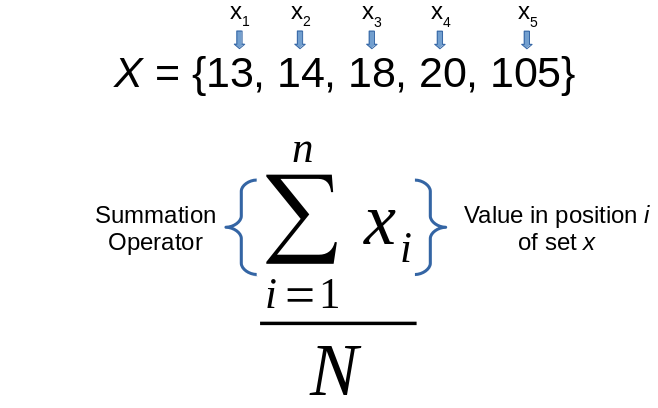

### Consider the mean

The mean, better known as the average, is probably the most widely known and ubiquitously reported statistic.

--

Despite it's commonality, and mathematical simplicity, it is poorly understood
 - "What is the mean?" is often answered tautologicaly:  "The mean is the average."
 
--

The mean has some elegant properties, but we need to understand what those properties are so we know when to use the mean, and when not

--

We're going to use the median as a foil, to better understand the mean by comparison

---

### A simple data set

```{r}
data <- data.frame(y = c(13, 14, 18, 20, 105),
                   z = c("redacted")
                   )
data
```

---

### A tale of two summaries

```{r message=FALSE, warning=FALSE}
library(dplyr)
summarize(data,
          mean = mean(y),
          median = median(y)
          )
```

--

Which should we use to communicate with? Depends on the goal of your communication!

--

The goal of reporting a summary statistic is often to give the reader a sense of what a "typical" or "likely" value is for the variable you measured

How do you think these summaries fare as "typical" values?

---

### 105 is an hourly rate? Sign me up!

What if these data were hourly wages in dollars for employees at a coffee shop?

```{r echo=FALSE}
data <- data.frame(hourly_wage = c(13, 14, 18, 20, 105),
                   job_title = c("barista", "barista", "asst. manager", "manager", "Corporate Efficiency Consultant")
                   )
data
```

And what if you were told "A typical hourly wage is $34" when you interviewed for job?

---

### Why the big difference

The mean uses actual magnitudes in it's calculations, while the median only uses ranks (i.e., *relative* magnitudes)

--

The median is, quite literally, the middle number

You sort the values, and the median is the number in the middle (same number of values above it as below it)

--

$${13, 14, 18, 20, 105}$$

Since our data are already in order, it's easy to see the median is 18 (two values greater than 18, two values less than 18)

---

### Computing the mean

The mean uses actual magnitudes in it's calculations, while the median only uses ranks (i.e., *relative* magnitudes)

--


---

### Computing the mean

The mean uses actual magnitudes in it's calculations, while the median only uses ranks (i.e., *relative* magnitudes)


---

### Computing the mean

The mean uses actual magnitudes in it's calculations, while the median only uses ranks (i.e., *relative* magnitudes)


---

### Computing the mean

The mean uses actual magnitudes in it's calculations, while the median only uses ranks (i.e., *relative* magnitudes)




---

### Computing the mean

The mean uses actual magnitudes in it's calculations, while the median only uses ranks (i.e., *relative* magnitudes)


---

### Computing the mean

The mean uses actual magnitudes in it's calculations, while the median only uses ranks (i.e., *relative* magnitudes)


---

### Computing the mean

The mean uses actual magnitudes in it's calculations, while the median only uses ranks (i.e., *relative* magnitudes)


---

### Computing the mean
This way of writing the equation is necessary to be both precise *and* general purpose

So this:

$$\frac{\sum\limits_{i=1}^N x_i}{N}$$

--

just means do this with our 5 observations:

$$\frac{13 + 14 + 18 + 20 + 105}{5}$$

--

or do this in R

```{r}
mean(c(13, 14, 18, 20, 105))
```

---

### The mean vs. the median

The mean uses actual magnitudes in it's calculations, while the median only uses ranks (i.e., *relative* magnitudes)

Increasing the largest value will keep increasing the mean (the sum in the numerator keeps going up), but since that doesn't change the order of the data, the median never changes (18 is still in the middle of the sequence)!

--

.pull-left[
```{r}
mean(c(13, 14, 18, 20, 105))
mean(c(13, 14, 18, 20, 1005))
mean(c(13, 14, 18, 20, 10005))
```
]

--

.pull-right[
```{r}
median(c(13, 14, 18, 20, 105))
median(c(13, 14, 18, 20, 1005))
median(c(13, 14, 18, 20, 10005))
```
]

---

### The median is robust

.center[

]

The mean is pulled towards tail more than median in a skewed distribution
  - As a consequence: mean is sensitive to outliers, median is robust to outliers

---

### What's good about the mean?

The mean is a balance point - the "center of mass" of the distribution. Here's how:


---

### What's good about the mean?

The mean is a balance point - the "center of mass" of the distribution. Here's how:


---

### What's good about the mean?

The mean is a balance point - the "center of mass" of the distribution. Here's how:


---

### What's good about the mean?

The mean is a balance point - the "center of mass" of the distribution. Here's how:


---

### What's good about the mean?

The mean is a balance point - the "center of mass" of the distribution. Here's how:


---

### What's good about the mean?

The mean is a balance point - the "center of mass" of the distribution. Here's how:


---

### What's good about the mean?


The mean is the “balance point” because the sum of error on both sides is 0


Overprediction and underprediction error literally balances out

---

### Recap

The median is the "middle number" - a distribution has the same number of values above the median and below the median

The mean is the "balance point" - the sum of deviations around the mean is 0 (error "balances out")

--

Prefer summarizing with the median when you want to convey "typicality" - especially when you're dealing with a skewed distribution

Prefer summarizing with the mean when you want to balance overestimation with underestimation

--

If you're not sure which above the above is more important, go with the median


